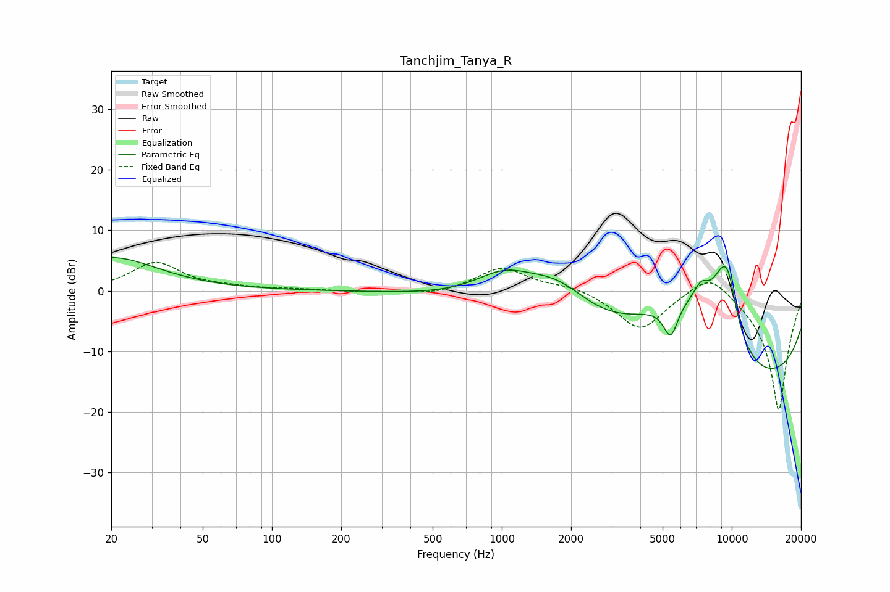

# Tanchjim_Tanya_R
See [usage instructions](https://github.com/jaakkopasanen/AutoEq#usage) for more options and info.

### Parametric EQs
Apply preamp of -5.6 dB when using parametric equalizer.

|   # | Type    |   Fc (Hz) |    Q |   Gain (dB) |
|-----|---------|-----------|------|-------------|
|   1 | Peaking |        20 | 0.7  |         5.5 |
|   2 | Peaking |      1027 | 1    |         5.3 |
|   3 | Peaking |      1753 | 0.93 |         6.5 |
|   4 | Peaking |      5273 | 0.62 |         6   |
|   5 | Peaking |      5425 | 4.2  |        -5.7 |
|   6 | Peaking |      6816 | 0.72 |         9.4 |
|   7 | Peaking |      7369 | 4.18 |         2.6 |
|   8 | Peaking |      8788 | 0.18 |       -19.9 |
|   9 | Peaking |      9123 | 2.02 |         9.1 |
|  10 | Peaking |      9681 | 3.49 |         5.1 |

### Fixed Band EQs
When using fixed band (also called graphic) equalizer, apply preamp of **-4.8 dB** (if available) and set gains manually with these parameters.

|   # | Type    |   Fc (Hz) |    Q |   Gain (dB) |
|-----|---------|-----------|------|-------------|
|   1 | Peaking |        31 | 1.41 |         4.6 |
|   2 | Peaking |        62 | 1.41 |         0.4 |
|   3 | Peaking |       125 | 1.41 |         0.2 |
|   4 | Peaking |       250 | 1.41 |        -0.2 |
|   5 | Peaking |       500 | 1.41 |        -0.7 |
|   6 | Peaking |      1000 | 1.41 |         3.9 |
|   7 | Peaking |      2000 | 1.41 |         0.9 |
|   8 | Peaking |      4000 | 1.41 |        -6.5 |
|   9 | Peaking |      8000 | 1.41 |         4   |
|  10 | Peaking |     16000 | 1.41 |       -20   |

### Graphs

