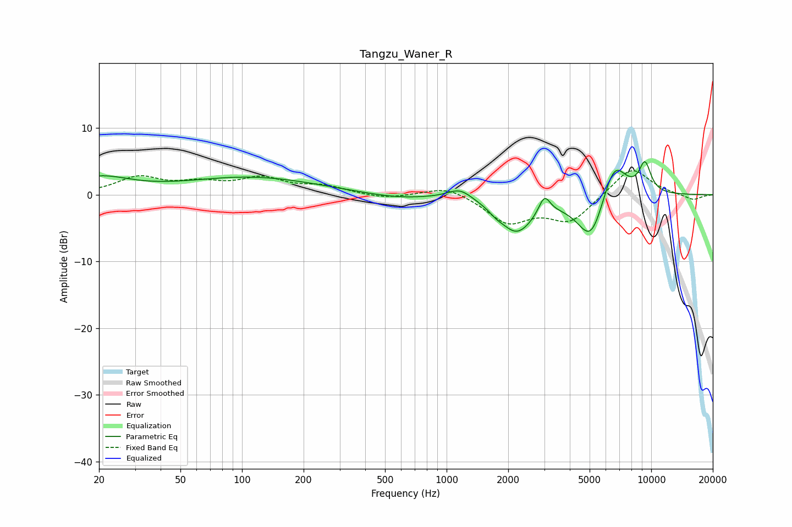

# Tangzu_Waner_R
See [usage instructions](https://github.com/jaakkopasanen/AutoEq#usage) for more options and info.

### Parametric EQs
Apply preamp of -5.0 dB when using parametric equalizer.

|   # | Type    |   Fc (Hz) |    Q |   Gain (dB) |
|-----|---------|-----------|------|-------------|
|   1 | Peaking |        20 | 0.96 |         2.4 |
|   2 | Peaking |       111 | 0.44 |         2.6 |
|   3 | Peaking |       567 | 0.89 |        -0.7 |
|   4 | Peaking |      1164 | 2.33 |         1.6 |
|   5 | Peaking |      1741 | 5.02 |        -0.4 |
|   6 | Peaking |      2198 | 1.62 |        -5.5 |
|   7 | Peaking |      3006 | 5.08 |         2.8 |
|   8 | Peaking |      5086 | 2.01 |        -7.4 |
|   9 | Peaking |      6575 | 2.21 |         6.4 |
|  10 | Peaking |      9323 | 4.25 |         4.4 |

### Fixed Band EQs
When using fixed band (also called graphic) equalizer, apply preamp of **-3.7 dB** (if available) and set gains manually with these parameters.

|   # | Type    |   Fc (Hz) |    Q |   Gain (dB) |
|-----|---------|-----------|------|-------------|
|   1 | Peaking |        31 | 1.41 |         2.5 |
|   2 | Peaking |        62 | 1.41 |         1.4 |
|   3 | Peaking |       125 | 1.41 |         2.3 |
|   4 | Peaking |       250 | 1.41 |         1.1 |
|   5 | Peaking |       500 | 1.41 |        -0.6 |
|   6 | Peaking |      1000 | 1.41 |         1.4 |
|   7 | Peaking |      2000 | 1.41 |        -4   |
|   8 | Peaking |      4000 | 1.41 |        -3.9 |
|   9 | Peaking |      8000 | 1.41 |         4.3 |
|  10 | Peaking |     16000 | 1.41 |        -0.9 |

### Graphs

