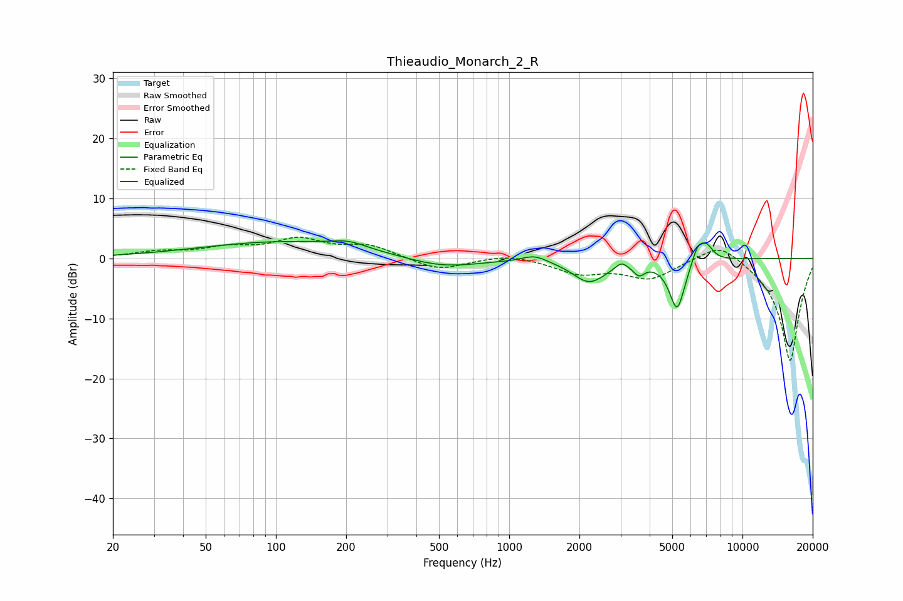

# Thieaudio_Monarch_2_R
See [usage instructions](https://github.com/jaakkopasanen/AutoEq#usage) for more options and info.

### Parametric EQs
Apply preamp of -3.0 dB when using parametric equalizer.

|   # | Type    |   Fc (Hz) |    Q |   Gain (dB) |
|-----|---------|-----------|------|-------------|
|   1 | Peaking |       111 | 0.38 |         2.8 |
|   2 | Peaking |       204 | 1.96 |         1   |
|   3 | Peaking |       514 | 0.89 |        -1.8 |
|   4 | Peaking |      1285 | 2.65 |         1.1 |
|   5 | Peaking |      2204 | 1.97 |        -3.8 |
|   6 | Peaking |      3028 | 5.84 |         1.1 |
|   7 | Peaking |      3601 | 6    |        -1.7 |
|   8 | Peaking |      5247 | 4.04 |        -8.5 |
|   9 | Peaking |      6443 | 5.04 |         3   |
|  10 | Peaking |      7039 | 4.88 |         2.2 |

### Fixed Band EQs
When using fixed band (also called graphic) equalizer, apply preamp of **-3.6 dB** (if available) and set gains manually with these parameters.

|   # | Type    |   Fc (Hz) |    Q |   Gain (dB) |
|-----|---------|-----------|------|-------------|
|   1 | Peaking |        31 | 1.41 |         1   |
|   2 | Peaking |        62 | 1.41 |         1.5 |
|   3 | Peaking |       125 | 1.41 |         2.9 |
|   4 | Peaking |       250 | 1.41 |         2   |
|   5 | Peaking |       500 | 1.41 |        -2   |
|   6 | Peaking |      1000 | 1.41 |         0.8 |
|   7 | Peaking |      2000 | 1.41 |        -2.3 |
|   8 | Peaking |      4000 | 1.41 |        -3.2 |
|   9 | Peaking |      8000 | 1.41 |         3.2 |
|  10 | Peaking |     16000 | 1.41 |       -17.3 |

### Graphs

