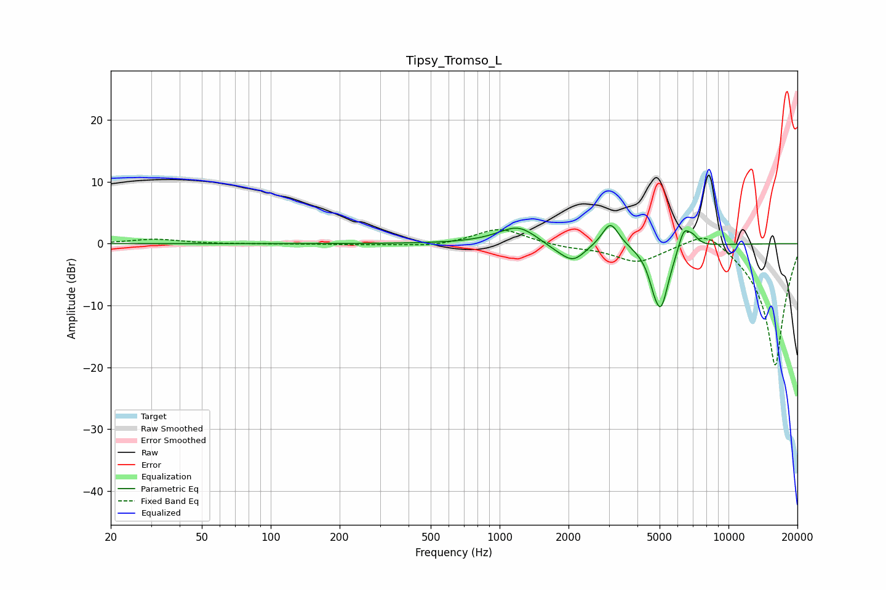

# Tipsy_Tromso_L
See [usage instructions](https://github.com/jaakkopasanen/AutoEq#usage) for more options and info.

### Parametric EQs
Apply preamp of -3.0 dB when using parametric equalizer.

|   # | Type    |   Fc (Hz) |    Q |   Gain (dB) |
|-----|---------|-----------|------|-------------|
|   1 | Peaking |      1097 | 1.16 |         0.5 |
|   2 | Peaking |      1212 | 1.77 |         2.5 |
|   3 | Peaking |      1749 | 1.89 |        -0.4 |
|   4 | Peaking |      1805 | 2    |        -0.5 |
|   5 | Peaking |      2099 | 2.67 |        -2.6 |
|   6 | Peaking |      3050 | 3.86 |         4   |
|   7 | Peaking |      4721 | 5.97 |        -1.7 |
|   8 | Peaking |      5072 | 3.79 |        -9.9 |
|   9 | Peaking |      6379 | 5.37 |         3.5 |
|  10 | Peaking |      6984 | 5.57 |         1.4 |

### Fixed Band EQs
When using fixed band (also called graphic) equalizer, apply preamp of **-2.4 dB** (if available) and set gains manually with these parameters.

|   # | Type    |   Fc (Hz) |    Q |   Gain (dB) |
|-----|---------|-----------|------|-------------|
|   1 | Peaking |        31 | 1.41 |         0.7 |
|   2 | Peaking |        62 | 1.41 |        -0   |
|   3 | Peaking |       125 | 1.41 |        -0   |
|   4 | Peaking |       250 | 1.41 |        -0.2 |
|   5 | Peaking |       500 | 1.41 |        -0.5 |
|   6 | Peaking |      1000 | 1.41 |         2.6 |
|   7 | Peaking |      2000 | 1.41 |        -0.5 |
|   8 | Peaking |      4000 | 1.41 |        -2.9 |
|   9 | Peaking |      8000 | 1.41 |         3   |
|  10 | Peaking |     16000 | 1.41 |       -20   |

### Graphs

