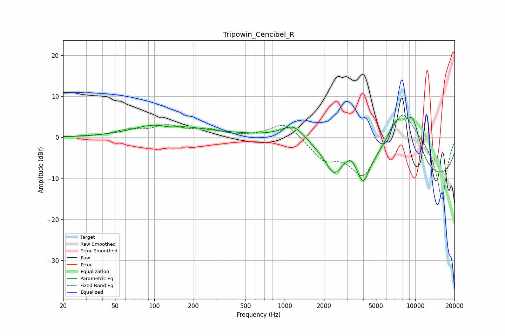

# Tripowin_Cencibel_R
See [usage instructions](https://github.com/jaakkopasanen/AutoEq#usage) for more options and info.

### Parametric EQs
Apply preamp of -5.0 dB when using parametric equalizer.

|   # | Type    |   Fc (Hz) |    Q |   Gain (dB) |
|-----|---------|-----------|------|-------------|
|   1 | Peaking |       117 | 0.77 |         3.6 |
|   2 | Peaking |       129 | 1.64 |        -1.6 |
|   3 | Peaking |       630 | 0.19 |         1.2 |
|   4 | Peaking |      1180 | 1.42 |         4.6 |
|   5 | Peaking |      2365 | 2.55 |        -4.5 |
|   6 | Peaking |      3224 | 3.07 |         2.7 |
|   7 | Peaking |      3981 | 3.1  |        -6.2 |
|   8 | Peaking |      7205 | 1.17 |        13   |
|   9 | Peaking |      9444 | 0.18 |       -12   |
|  10 | Peaking |      9609 | 1.99 |         9.3 |

### Fixed Band EQs
When using fixed band (also called graphic) equalizer, apply preamp of **-5.5 dB** (if available) and set gains manually with these parameters.

|   # | Type    |   Fc (Hz) |    Q |   Gain (dB) |
|-----|---------|-----------|------|-------------|
|   1 | Peaking |        31 | 1.41 |         0   |
|   2 | Peaking |        62 | 1.41 |         1.5 |
|   3 | Peaking |       125 | 1.41 |         2.5 |
|   4 | Peaking |       250 | 1.41 |         1.7 |
|   5 | Peaking |       500 | 1.41 |         0.1 |
|   6 | Peaking |      1000 | 1.41 |         4   |
|   7 | Peaking |      2000 | 1.41 |        -4.9 |
|   8 | Peaking |      4000 | 1.41 |        -9.6 |
|   9 | Peaking |      8000 | 1.41 |         8.2 |
|  10 | Peaking |     16000 | 1.41 |       -15.5 |

### Graphs

