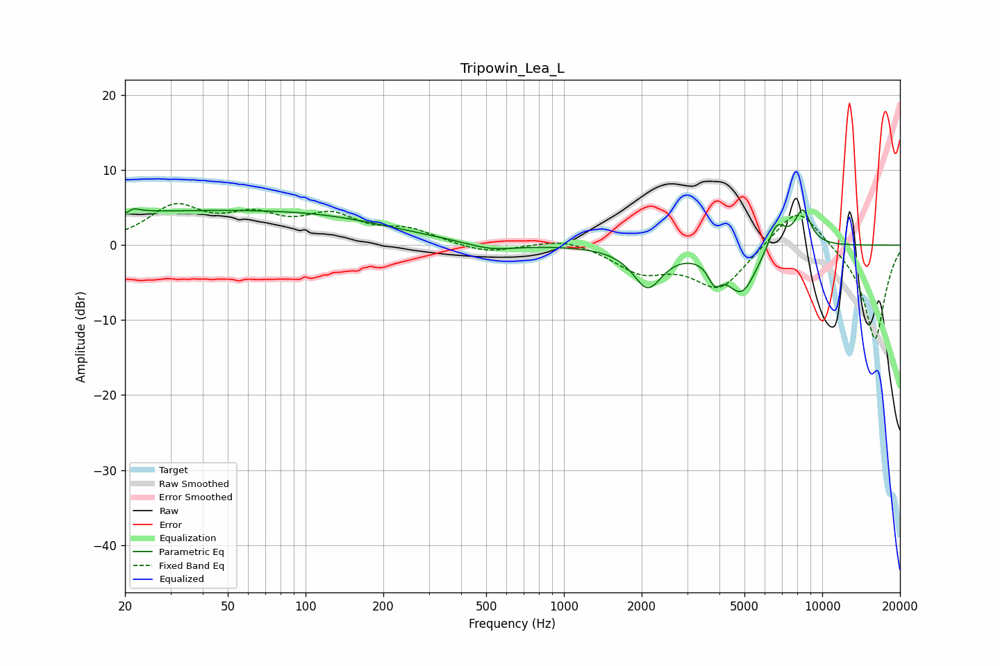

# Tripowin_Lea_L
See [usage instructions](https://github.com/jaakkopasanen/AutoEq#usage) for more options and info.

### Parametric EQs
Apply preamp of -4.9 dB when using parametric equalizer.

|   # | Type    |   Fc (Hz) |    Q |   Gain (dB) |
|-----|---------|-----------|------|-------------|
|   1 | Peaking |        21 | 5.69 |        -3   |
|   2 | Peaking |        21 | 5.41 |         3.2 |
|   3 | Peaking |        32 | 0.18 |         4.4 |
|   4 | Peaking |       138 | 0.53 |         0.9 |
|   5 | Peaking |       523 | 1.43 |        -1   |
|   6 | Peaking |      2111 | 2.48 |        -5.4 |
|   7 | Peaking |      3827 | 5.7  |        -2.6 |
|   8 | Peaking |      4872 | 2.24 |        -6.3 |
|   9 | Peaking |      6658 | 3.83 |         3.8 |
|  10 | Peaking |      8407 | 4.09 |         4.8 |

### Fixed Band EQs
When using fixed band (also called graphic) equalizer, apply preamp of **-5.7 dB** (if available) and set gains manually with these parameters.

|   # | Type    |   Fc (Hz) |    Q |   Gain (dB) |
|-----|---------|-----------|------|-------------|
|   1 | Peaking |        31 | 1.41 |         4.8 |
|   2 | Peaking |        62 | 1.41 |         3.2 |
|   3 | Peaking |       125 | 1.41 |         3.5 |
|   4 | Peaking |       250 | 1.41 |         1.8 |
|   5 | Peaking |       500 | 1.41 |        -1.2 |
|   6 | Peaking |      1000 | 1.41 |         1.1 |
|   7 | Peaking |      2000 | 1.41 |        -3.3 |
|   8 | Peaking |      4000 | 1.41 |        -5.8 |
|   9 | Peaking |      8000 | 1.41 |         5.8 |
|  10 | Peaking |     16000 | 1.41 |       -12.8 |

### Graphs

