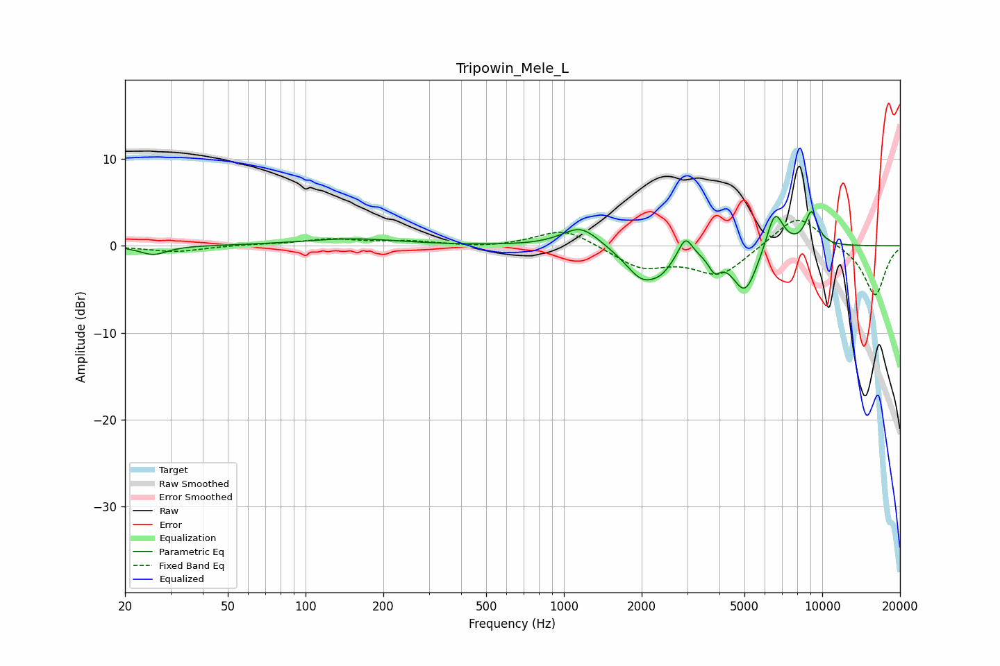

# Tripowin_Mele_L
See [usage instructions](https://github.com/jaakkopasanen/AutoEq#usage) for more options and info.

### Parametric EQs
Apply preamp of -4.0 dB when using parametric equalizer.

|   # | Type    |   Fc (Hz) |    Q |   Gain (dB) |
|-----|---------|-----------|------|-------------|
|   1 | Peaking |        26 | 2.73 |        -1   |
|   2 | Peaking |       150 | 0.76 |         0.8 |
|   3 | Peaking |      1164 | 1.95 |         2.4 |
|   4 | Peaking |      2023 | 2.07 |        -3.8 |
|   5 | Peaking |      2406 | 3.41 |        -1.2 |
|   6 | Peaking |      2955 | 5.43 |         2.4 |
|   7 | Peaking |      3827 | 5.99 |        -1.8 |
|   8 | Peaking |      5025 | 2.81 |        -5.3 |
|   9 | Peaking |      6558 | 4.09 |         4.6 |
|  10 | Peaking |      9090 | 5    |         3.9 |

### Fixed Band EQs
When using fixed band (also called graphic) equalizer, apply preamp of **-3.0 dB** (if available) and set gains manually with these parameters.

|   # | Type    |   Fc (Hz) |    Q |   Gain (dB) |
|-----|---------|-----------|------|-------------|
|   1 | Peaking |        31 | 1.41 |        -0.7 |
|   2 | Peaking |        62 | 1.41 |         0.1 |
|   3 | Peaking |       125 | 1.41 |         0.7 |
|   4 | Peaking |       250 | 1.41 |         0.5 |
|   5 | Peaking |       500 | 1.41 |        -0.2 |
|   6 | Peaking |      1000 | 1.41 |         2.1 |
|   7 | Peaking |      2000 | 1.41 |        -2.4 |
|   8 | Peaking |      4000 | 1.41 |        -3.4 |
|   9 | Peaking |      8000 | 1.41 |         3.8 |
|  10 | Peaking |     16000 | 1.41 |        -5.8 |

### Graphs

