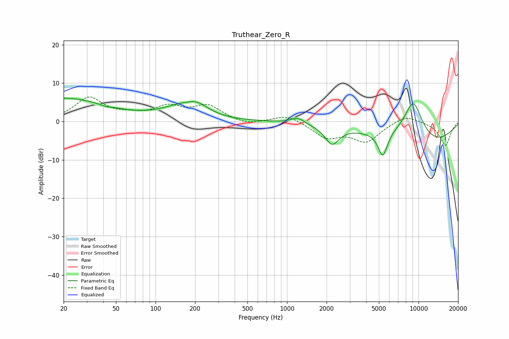

# Truthear_Zero_R
See [usage instructions](https://github.com/jaakkopasanen/AutoEq#usage) for more options and info.

### Parametric EQs
Apply preamp of -6.2 dB when using parametric equalizer.

|   # | Type    |   Fc (Hz) |    Q |   Gain (dB) |
|-----|---------|-----------|------|-------------|
|   1 | Peaking |        20 | 0.44 |         6   |
|   2 | Peaking |        42 | 4.85 |        -0.3 |
|   3 | Peaking |       155 | 0.92 |         3   |
|   4 | Peaking |       209 | 1.65 |         2.4 |
|   5 | Peaking |      1127 | 3.37 |         0.8 |
|   6 | Peaking |      1263 | 3.56 |         0.9 |
|   7 | Peaking |      2199 | 2.63 |        -4.8 |
|   8 | Peaking |      5351 | 3.95 |        -6.5 |
|   9 | Peaking |      9137 | 1.27 |        15.2 |
|  10 | Peaking |     10000 | 0.45 |       -10.5 |

### Fixed Band EQs
When using fixed band (also called graphic) equalizer, apply preamp of **-6.5 dB** (if available) and set gains manually with these parameters.

|   # | Type    |   Fc (Hz) |    Q |   Gain (dB) |
|-----|---------|-----------|------|-------------|
|   1 | Peaking |        31 | 1.41 |         6   |
|   2 | Peaking |        62 | 1.41 |         1.2 |
|   3 | Peaking |       125 | 1.41 |         3.4 |
|   4 | Peaking |       250 | 1.41 |         3.8 |
|   5 | Peaking |       500 | 1.41 |        -1.1 |
|   6 | Peaking |      1000 | 1.41 |         1.9 |
|   7 | Peaking |      2000 | 1.41 |        -3.9 |
|   8 | Peaking |      4000 | 1.41 |        -5   |
|   9 | Peaking |      8000 | 1.41 |         1.9 |
|  10 | Peaking |     16000 | 1.41 |        -6.2 |

### Graphs

