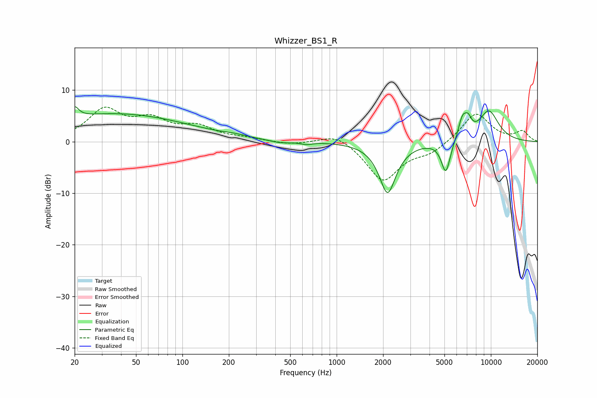

# Whizzer_BS1_R
See [usage instructions](https://github.com/jaakkopasanen/AutoEq#usage) for more options and info.

### Parametric EQs
Apply preamp of -6.9 dB when using parametric equalizer.

|   # | Type    |   Fc (Hz) |    Q |   Gain (dB) |
|-----|---------|-----------|------|-------------|
|   1 | Peaking |        20 | 5.51 |         2.1 |
|   2 | Peaking |        36 | 0.29 |         5.4 |
|   3 | Peaking |       218 | 2.24 |         0.3 |
|   4 | Peaking |       430 | 1.98 |        -0.5 |
|   5 | Peaking |       638 | 3.71 |        -0.5 |
|   6 | Peaking |      2140 | 2.56 |        -9.9 |
|   7 | Peaking |      5106 | 4.7  |        -6.3 |
|   8 | Peaking |      6538 | 4.96 |         3.8 |
|   9 | Peaking |      7118 | 5.77 |         2.4 |
|  10 | Peaking |      9696 | 1.85 |         5.9 |

### Fixed Band EQs
When using fixed band (also called graphic) equalizer, apply preamp of **-6.8 dB** (if available) and set gains manually with these parameters.

|   # | Type    |   Fc (Hz) |    Q |   Gain (dB) |
|-----|---------|-----------|------|-------------|
|   1 | Peaking |        31 | 1.41 |         5.9 |
|   2 | Peaking |        62 | 1.41 |         3.6 |
|   3 | Peaking |       125 | 1.41 |         2.5 |
|   4 | Peaking |       250 | 1.41 |         0.5 |
|   5 | Peaking |       500 | 1.41 |        -0.6 |
|   6 | Peaking |      1000 | 1.41 |         1.9 |
|   7 | Peaking |      2000 | 1.41 |        -7.6 |
|   8 | Peaking |      4000 | 1.41 |        -1.9 |
|   9 | Peaking |      8000 | 1.41 |         5.7 |
|  10 | Peaking |     16000 | 1.41 |         1.9 |

### Graphs

