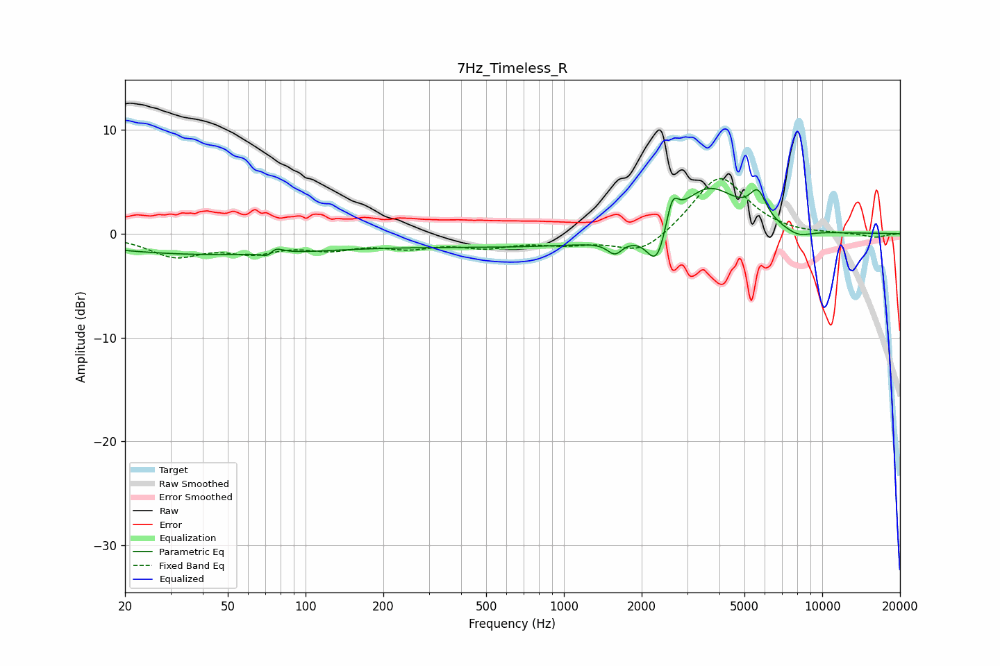

# 7Hz_Timeless_R
See [usage instructions](https://github.com/jaakkopasanen/AutoEq#usage) for more options and info.

### Parametric EQs
Apply preamp of -4.5 dB when using parametric equalizer.

|   # | Type    |   Fc (Hz) |    Q |   Gain (dB) |
|-----|---------|-----------|------|-------------|
|   1 | Peaking |        42 | 0.29 |        -2   |
|   2 | Peaking |        73 | 5.37 |        -1.9 |
|   3 | Peaking |        74 | 5.04 |         2   |
|   4 | Peaking |       916 | 0.21 |        -1.3 |
|   5 | Peaking |      1576 | 4.83 |        -1.3 |
|   6 | Peaking |      2291 | 3.65 |        -3.9 |
|   7 | Peaking |      2625 | 5.98 |         2.8 |
|   8 | Peaking |      3611 | 1.14 |         5.2 |
|   9 | Peaking |      5635 | 4.33 |         2.6 |
|  10 | Peaking |      8054 | 2.44 |        -0.7 |

### Fixed Band EQs
When using fixed band (also called graphic) equalizer, apply preamp of **-5.4 dB** (if available) and set gains manually with these parameters.

|   # | Type    |   Fc (Hz) |    Q |   Gain (dB) |
|-----|---------|-----------|------|-------------|
|   1 | Peaking |        31 | 1.41 |        -2   |
|   2 | Peaking |        62 | 1.41 |        -1.5 |
|   3 | Peaking |       125 | 1.41 |        -1.2 |
|   4 | Peaking |       250 | 1.41 |        -1.1 |
|   5 | Peaking |       500 | 1.41 |        -1.1 |
|   6 | Peaking |      1000 | 1.41 |        -0.8 |
|   7 | Peaking |      2000 | 1.41 |        -2.1 |
|   8 | Peaking |      4000 | 1.41 |         5.7 |
|   9 | Peaking |      8000 | 1.41 |        -0.1 |
|  10 | Peaking |     16000 | 1.41 |        -0.4 |

### Graphs

