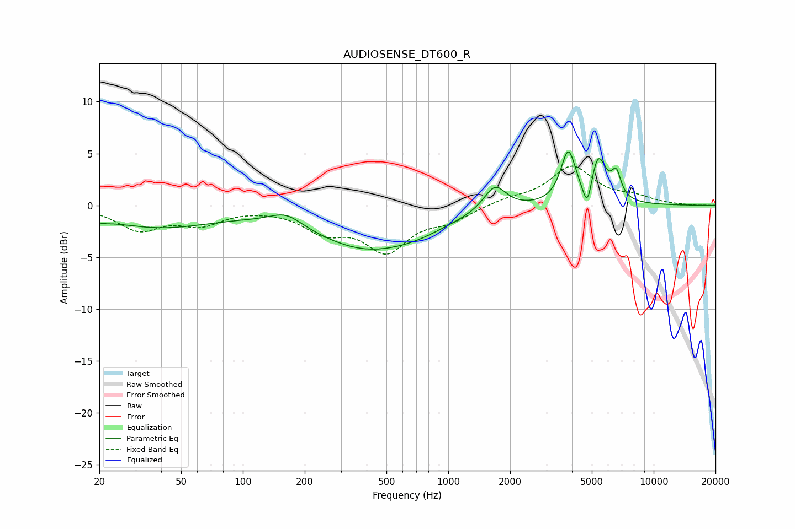

# AUDIOSENSE_DT600_R
See [usage instructions](https://github.com/jaakkopasanen/AutoEq#usage) for more options and info.

### Parametric EQs
Apply preamp of -5.2 dB when using parametric equalizer.

|   # | Type    |   Fc (Hz) |    Q |   Gain (dB) |
|-----|---------|-----------|------|-------------|
|   1 | Peaking |        20 | 2.9  |        -0.4 |
|   2 | Peaking |        39 | 0.52 |        -2   |
|   3 | Peaking |       162 | 1.8  |         1.2 |
|   4 | Peaking |       399 | 0.54 |        -4   |
|   5 | Peaking |       722 | 0.96 |        -0.7 |
|   6 | Peaking |      1686 | 2.62 |         2.5 |
|   7 | Peaking |      3839 | 3.9  |         4.9 |
|   8 | Peaking |      4763 | 6    |        -3   |
|   9 | Peaking |      5352 | 3.52 |         4.6 |
|  10 | Peaking |      6574 | 6    |         2.3 |

### Fixed Band EQs
When using fixed band (also called graphic) equalizer, apply preamp of **-3.9 dB** (if available) and set gains manually with these parameters.

|   # | Type    |   Fc (Hz) |    Q |   Gain (dB) |
|-----|---------|-----------|------|-------------|
|   1 | Peaking |        31 | 1.41 |        -2.2 |
|   2 | Peaking |        62 | 1.41 |        -1.6 |
|   3 | Peaking |       125 | 1.41 |        -0.1 |
|   4 | Peaking |       250 | 1.41 |        -2.2 |
|   5 | Peaking |       500 | 1.41 |        -4.1 |
|   6 | Peaking |      1000 | 1.41 |        -1.2 |
|   7 | Peaking |      2000 | 1.41 |         0.6 |
|   8 | Peaking |      4000 | 1.41 |         3.7 |
|   9 | Peaking |      8000 | 1.41 |         0.7 |
|  10 | Peaking |     16000 | 1.41 |        -0   |

### Graphs

