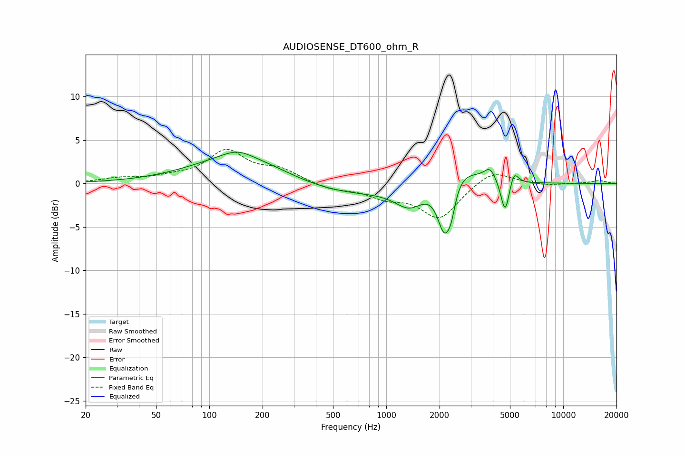

# AUDIOSENSE_DT600_ohm_R
See [usage instructions](https://github.com/jaakkopasanen/AutoEq#usage) for more options and info.

### Parametric EQs
Apply preamp of -3.7 dB when using parametric equalizer.

|   # | Type    |   Fc (Hz) |    Q |   Gain (dB) |
|-----|---------|-----------|------|-------------|
|   1 | Peaking |       143 | 1.82 |         0.8 |
|   2 | Peaking |       153 | 0.53 |         3.3 |
|   3 | Peaking |       527 | 0.44 |        -1.5 |
|   4 | Peaking |      1355 | 1.72 |        -2.4 |
|   5 | Peaking |      2129 | 3.48 |        -6.1 |
|   6 | Peaking |      2327 | 6    |        -2.1 |
|   7 | Peaking |      2491 | 1.25 |         2.7 |
|   8 | Peaking |      3859 | 4.32 |         1.4 |
|   9 | Peaking |      4697 | 5.91 |        -4   |
|  10 | Peaking |      5263 | 6    |         1.7 |

### Fixed Band EQs
When using fixed band (also called graphic) equalizer, apply preamp of **-4.0 dB** (if available) and set gains manually with these parameters.

|   # | Type    |   Fc (Hz) |    Q |   Gain (dB) |
|-----|---------|-----------|------|-------------|
|   1 | Peaking |        31 | 1.41 |         0.5 |
|   2 | Peaking |        62 | 1.41 |         0.5 |
|   3 | Peaking |       125 | 1.41 |         3.6 |
|   4 | Peaking |       250 | 1.41 |         1.4 |
|   5 | Peaking |       500 | 1.41 |        -0.7 |
|   6 | Peaking |      1000 | 1.41 |        -1.4 |
|   7 | Peaking |      2000 | 1.41 |        -4   |
|   8 | Peaking |      4000 | 1.41 |         1.7 |
|   9 | Peaking |      8000 | 1.41 |        -0.2 |
|  10 | Peaking |     16000 | 1.41 |         0.3 |

### Graphs

