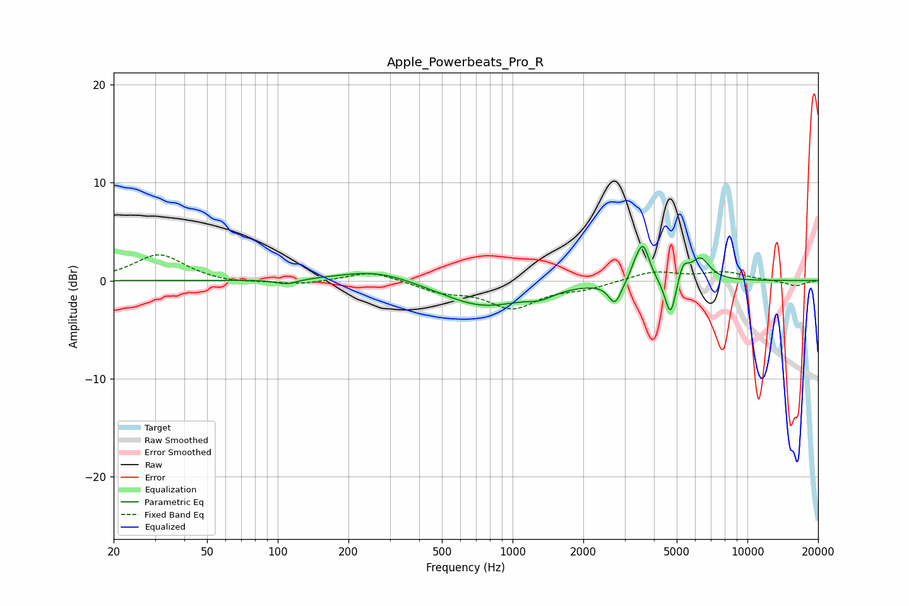

# Apple_Powerbeats_Pro_R
See [usage instructions](https://github.com/jaakkopasanen/AutoEq#usage) for more options and info.

### Parametric EQs
Apply preamp of -3.6 dB when using parametric equalizer.

|   # | Type    |   Fc (Hz) |    Q |   Gain (dB) |
|-----|---------|-----------|------|-------------|
|   1 | Peaking |       109 | 3.07 |        -0.5 |
|   2 | Peaking |       263 | 0.89 |         1.2 |
|   3 | Peaking |       749 | 0.79 |        -2.6 |
|   4 | Peaking |      1314 | 2.47 |        -0.7 |
|   5 | Peaking |      2730 | 5.22 |        -2.3 |
|   6 | Peaking |      3340 | 6    |         1   |
|   7 | Peaking |      3604 | 5.32 |         3.5 |
|   8 | Peaking |      4709 | 5.93 |        -4.1 |
|   9 | Peaking |      5321 | 6    |         1.8 |
|  10 | Peaking |      6304 | 3.44 |         2.3 |

### Fixed Band EQs
When using fixed band (also called graphic) equalizer, apply preamp of **-2.7 dB** (if available) and set gains manually with these parameters.

|   # | Type    |   Fc (Hz) |    Q |   Gain (dB) |
|-----|---------|-----------|------|-------------|
|   1 | Peaking |        31 | 1.41 |         2.7 |
|   2 | Peaking |        62 | 1.41 |        -0.3 |
|   3 | Peaking |       125 | 1.41 |        -0.4 |
|   4 | Peaking |       250 | 1.41 |         1   |
|   5 | Peaking |       500 | 1.41 |        -1   |
|   6 | Peaking |      1000 | 1.41 |        -2.7 |
|   7 | Peaking |      2000 | 1.41 |        -0.7 |
|   8 | Peaking |      4000 | 1.41 |         1   |
|   9 | Peaking |      8000 | 1.41 |         0.8 |
|  10 | Peaking |     16000 | 1.41 |        -0.6 |

### Graphs

