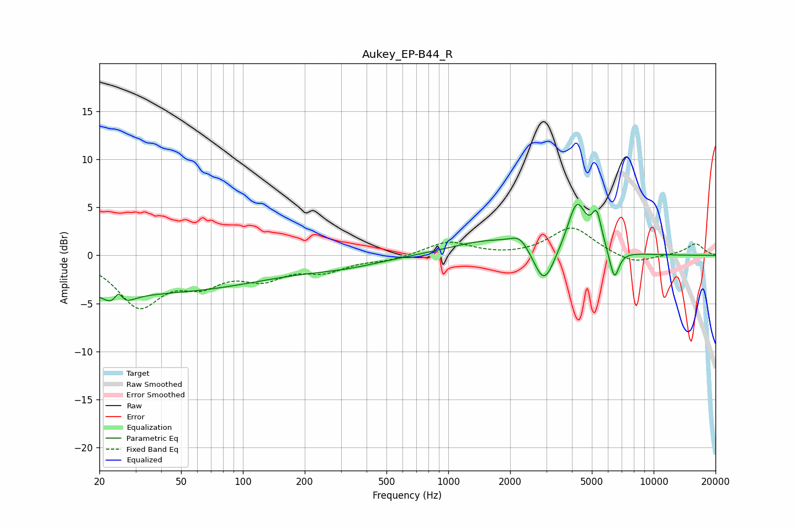

# Aukey_EP-B44_R
See [usage instructions](https://github.com/jaakkopasanen/AutoEq#usage) for more options and info.

### Parametric EQs
Apply preamp of -5.4 dB when using parametric equalizer.

|   # | Type    |   Fc (Hz) |    Q |   Gain (dB) |
|-----|---------|-----------|------|-------------|
|   1 | Peaking |        25 | 3.48 |        -3.4 |
|   2 | Peaking |        25 | 5.55 |         3.2 |
|   3 | Peaking |        31 | 0.21 |        -3.9 |
|   4 | Peaking |       313 | 0.72 |        -0.8 |
|   5 | Peaking |      1660 | 0.71 |         1.6 |
|   6 | Peaking |      2234 | 3.18 |         1.2 |
|   7 | Peaking |      2926 | 2.76 |        -4.1 |
|   8 | Peaking |      4229 | 3.08 |         5.2 |
|   9 | Peaking |      5280 | 5.77 |         3.3 |
|  10 | Peaking |      6433 | 5.96 |        -3.1 |

### Fixed Band EQs
When using fixed band (also called graphic) equalizer, apply preamp of **-2.9 dB** (if available) and set gains manually with these parameters.

|   # | Type    |   Fc (Hz) |    Q |   Gain (dB) |
|-----|---------|-----------|------|-------------|
|   1 | Peaking |        31 | 1.41 |        -5   |
|   2 | Peaking |        62 | 1.41 |        -2.4 |
|   3 | Peaking |       125 | 1.41 |        -2   |
|   4 | Peaking |       250 | 1.41 |        -1.4 |
|   5 | Peaking |       500 | 1.41 |        -0.5 |
|   6 | Peaking |      1000 | 1.41 |         1.4 |
|   7 | Peaking |      2000 | 1.41 |        -0.1 |
|   8 | Peaking |      4000 | 1.41 |         2.9 |
|   9 | Peaking |      8000 | 1.41 |        -1   |
|  10 | Peaking |     16000 | 1.41 |         1.2 |

### Graphs

