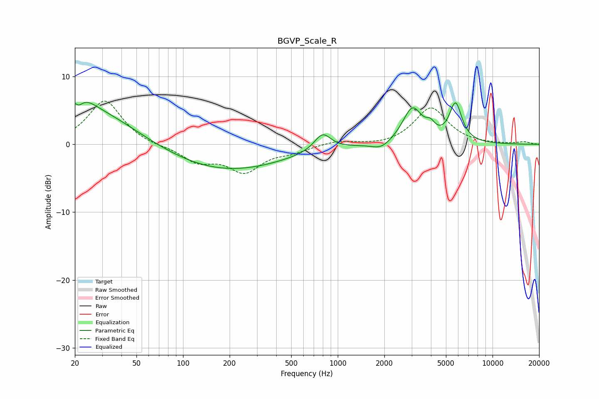

# BGVP_Scale_R
See [usage instructions](https://github.com/jaakkopasanen/AutoEq#usage) for more options and info.

### Parametric EQs
Apply preamp of -6.3 dB when using parametric equalizer.

|   # | Type    |   Fc (Hz) |    Q |   Gain (dB) |
|-----|---------|-----------|------|-------------|
|   1 | Peaking |        20 | 5.66 |         3.4 |
|   2 | Peaking |        21 | 5.87 |        -3.1 |
|   3 | Peaking |        23 | 2.01 |         1.7 |
|   4 | Peaking |        27 | 0.53 |         5   |
|   5 | Peaking |       188 | 0.37 |        -3.9 |
|   6 | Peaking |       797 | 2.64 |         2.6 |
|   7 | Peaking |      1910 | 2.31 |        -1.1 |
|   8 | Peaking |      3036 | 2.23 |         5.3 |
|   9 | Peaking |      3972 | 4.83 |         1.3 |
|  10 | Peaking |      5769 | 3.45 |         5.6 |

### Fixed Band EQs
When using fixed band (also called graphic) equalizer, apply preamp of **-6.5 dB** (if available) and set gains manually with these parameters.

|   # | Type    |   Fc (Hz) |    Q |   Gain (dB) |
|-----|---------|-----------|------|-------------|
|   1 | Peaking |        31 | 1.41 |         6.5 |
|   2 | Peaking |        62 | 1.41 |        -0.3 |
|   3 | Peaking |       125 | 1.41 |        -2.4 |
|   4 | Peaking |       250 | 1.41 |        -3.8 |
|   5 | Peaking |       500 | 1.41 |        -0.9 |
|   6 | Peaking |      1000 | 1.41 |         0.6 |
|   7 | Peaking |      2000 | 1.41 |        -0.3 |
|   8 | Peaking |      4000 | 1.41 |         5.4 |
|   9 | Peaking |      8000 | 1.41 |         0   |
|  10 | Peaking |     16000 | 1.41 |         0.3 |

### Graphs

