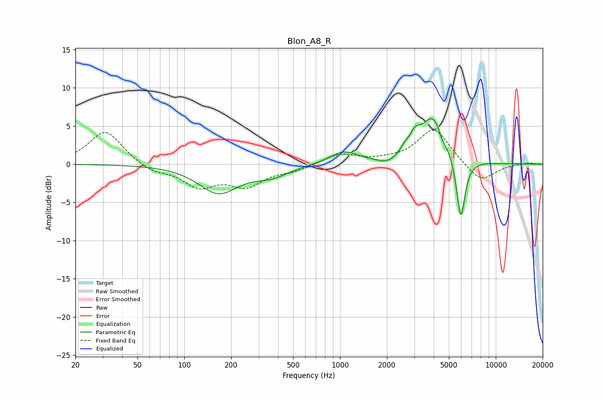

# Blon_A8_R
See [usage instructions](https://github.com/jaakkopasanen/AutoEq#usage) for more options and info.

### Parametric EQs
Apply preamp of -6.1 dB when using parametric equalizer.

|   # | Type    |   Fc (Hz) |    Q |   Gain (dB) |
|-----|---------|-----------|------|-------------|
|   1 | Peaking |       166 | 1.12 |        -3.7 |
|   2 | Peaking |       362 | 1.24 |        -1.3 |
|   3 | Peaking |      1037 | 2.31 |         0.2 |
|   4 | Peaking |      1064 | 1.47 |         1.5 |
|   5 | Peaking |      2003 | 2.54 |        -0.7 |
|   6 | Peaking |      2594 | 5.69 |         0.7 |
|   7 | Peaking |      3028 | 3.88 |         2   |
|   8 | Peaking |      3972 | 1.82 |         6.2 |
|   9 | Peaking |      4514 | 6    |        -0.9 |
|  10 | Peaking |      5963 | 4.92 |        -8.3 |

### Fixed Band EQs
When using fixed band (also called graphic) equalizer, apply preamp of **-4.5 dB** (if available) and set gains manually with these parameters.

|   # | Type    |   Fc (Hz) |    Q |   Gain (dB) |
|-----|---------|-----------|------|-------------|
|   1 | Peaking |        31 | 1.41 |         4.4 |
|   2 | Peaking |        62 | 1.41 |        -1   |
|   3 | Peaking |       125 | 1.41 |        -2.7 |
|   4 | Peaking |       250 | 1.41 |        -2.6 |
|   5 | Peaking |       500 | 1.41 |        -0.8 |
|   6 | Peaking |      1000 | 1.41 |         1.3 |
|   7 | Peaking |      2000 | 1.41 |         0.3 |
|   8 | Peaking |      4000 | 1.41 |         4.7 |
|   9 | Peaking |      8000 | 1.41 |        -2.5 |
|  10 | Peaking |     16000 | 1.41 |         0.2 |

### Graphs

