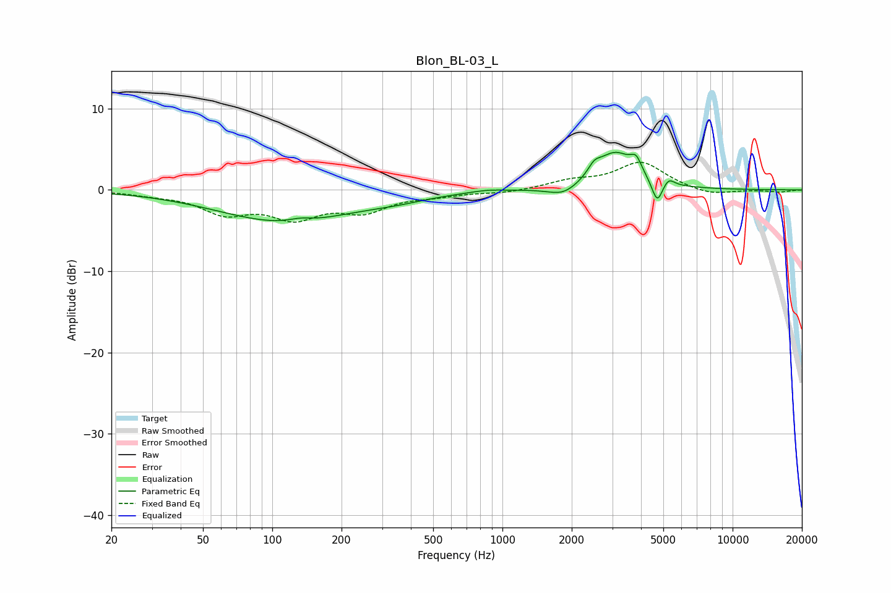

# Blon_BL-03_L
See [usage instructions](https://github.com/jaakkopasanen/AutoEq#usage) for more options and info.

### Parametric EQs
Apply preamp of -4.7 dB when using parametric equalizer.

|   # | Type    |   Fc (Hz) |    Q |   Gain (dB) |
|-----|---------|-----------|------|-------------|
|   1 | Peaking |       114 | 0.49 |        -3.9 |
|   2 | Peaking |       132 | 2.95 |         0.4 |
|   3 | Peaking |       346 | 1.01 |        -0.6 |
|   4 | Peaking |       858 | 1.96 |         0.3 |
|   5 | Peaking |      1847 | 2.1  |        -1.3 |
|   6 | Peaking |      2505 | 5.28 |         1.1 |
|   7 | Peaking |      3081 | 1.63 |         4.5 |
|   8 | Peaking |      3808 | 6    |         1.6 |
|   9 | Peaking |      4703 | 6    |        -2.9 |
|  10 | Peaking |      5270 | 5.98 |         0.9 |

### Fixed Band EQs
When using fixed band (also called graphic) equalizer, apply preamp of **-3.5 dB** (if available) and set gains manually with these parameters.

|   # | Type    |   Fc (Hz) |    Q |   Gain (dB) |
|-----|---------|-----------|------|-------------|
|   1 | Peaking |        31 | 1.41 |        -0.4 |
|   2 | Peaking |        62 | 1.41 |        -2.6 |
|   3 | Peaking |       125 | 1.41 |        -3   |
|   4 | Peaking |       250 | 1.41 |        -2.3 |
|   5 | Peaking |       500 | 1.41 |        -0.6 |
|   6 | Peaking |      1000 | 1.41 |        -0.4 |
|   7 | Peaking |      2000 | 1.41 |         1   |
|   8 | Peaking |      4000 | 1.41 |         3.4 |
|   9 | Peaking |      8000 | 1.41 |        -0.7 |
|  10 | Peaking |     16000 | 1.41 |        -0.3 |

### Graphs

