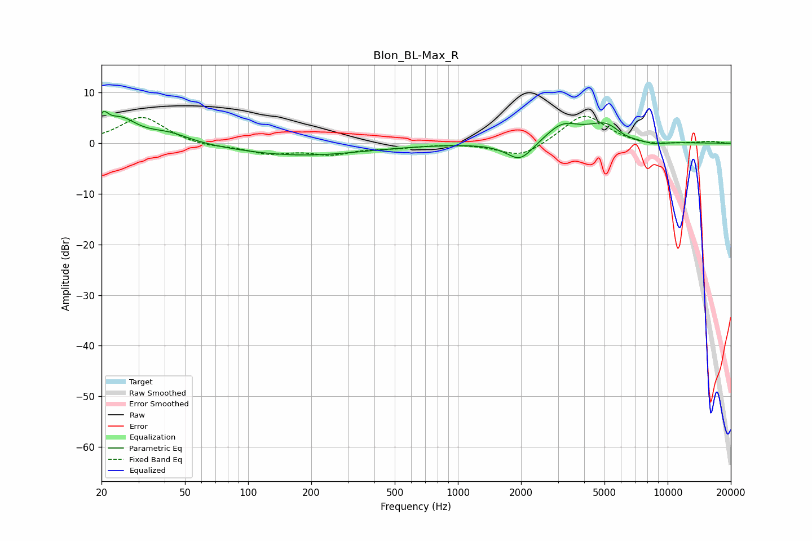

# Blon_BL-Max_R
See [usage instructions](https://github.com/jaakkopasanen/AutoEq#usage) for more options and info.

### Parametric EQs
Apply preamp of -6.4 dB when using parametric equalizer.

|   # | Type    |   Fc (Hz) |    Q |   Gain (dB) |
|-----|---------|-----------|------|-------------|
|   1 | Peaking |        20 | 5.83 |         3.1 |
|   2 | Peaking |        25 | 1.82 |         4.3 |
|   3 | Peaking |        43 | 1.29 |         2.5 |
|   4 | Peaking |        47 | 1.28 |        -0.6 |
|   5 | Peaking |       177 | 0.46 |        -2.4 |
|   6 | Peaking |      1980 | 2.18 |        -3.9 |
|   7 | Peaking |      3149 | 1.74 |         3.5 |
|   8 | Peaking |      5191 | 1.55 |         4.5 |
|   9 | Peaking |      5994 | 1.81 |        -1.7 |
|  10 | Peaking |      8556 | 2.35 |        -0.6 |

### Fixed Band EQs
When using fixed band (also called graphic) equalizer, apply preamp of **-5.4 dB** (if available) and set gains manually with these parameters.

|   # | Type    |   Fc (Hz) |    Q |   Gain (dB) |
|-----|---------|-----------|------|-------------|
|   1 | Peaking |        31 | 1.41 |         5.3 |
|   2 | Peaking |        62 | 1.41 |        -0.7 |
|   3 | Peaking |       125 | 1.41 |        -1.9 |
|   4 | Peaking |       250 | 1.41 |        -1.9 |
|   5 | Peaking |       500 | 1.41 |        -0.7 |
|   6 | Peaking |      1000 | 1.41 |         0   |
|   7 | Peaking |      2000 | 1.41 |        -2.9 |
|   8 | Peaking |      4000 | 1.41 |         5.9 |
|   9 | Peaking |      8000 | 1.41 |        -0.6 |
|  10 | Peaking |     16000 | 1.41 |         0.4 |

### Graphs

