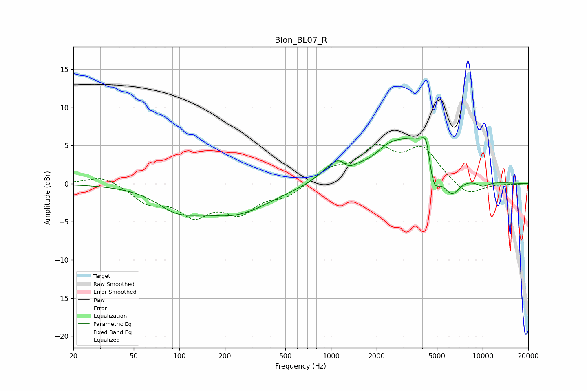

# Blon_BL07_R
See [usage instructions](https://github.com/jaakkopasanen/AutoEq#usage) for more options and info.

### Parametric EQs
Apply preamp of -6.1 dB when using parametric equalizer.

|   # | Type    |   Fc (Hz) |    Q |   Gain (dB) |
|-----|---------|-----------|------|-------------|
|   1 | Peaking |        97 | 1.06 |        -2.3 |
|   2 | Peaking |       229 | 0.59 |        -3.8 |
|   3 | Peaking |      1123 | 1.51 |         3   |
|   4 | Peaking |      1304 | 3.7  |        -1   |
|   5 | Peaking |      2434 | 1.37 |         2.6 |
|   6 | Peaking |      3959 | 1    |         5.9 |
|   7 | Peaking |      4281 | 4.81 |         4   |
|   8 | Peaking |      4685 | 3.09 |        -6.2 |
|   9 | Peaking |      6223 | 2.37 |        -3.3 |
|  10 | Peaking |     10000 | 2.75 |        -0.7 |

### Fixed Band EQs
When using fixed band (also called graphic) equalizer, apply preamp of **-5.2 dB** (if available) and set gains manually with these parameters.

|   # | Type    |   Fc (Hz) |    Q |   Gain (dB) |
|-----|---------|-----------|------|-------------|
|   1 | Peaking |        31 | 1.41 |         1.2 |
|   2 | Peaking |        62 | 1.41 |        -2.3 |
|   3 | Peaking |       125 | 1.41 |        -3.7 |
|   4 | Peaking |       250 | 1.41 |        -3.4 |
|   5 | Peaking |       500 | 1.41 |        -1.6 |
|   6 | Peaking |      1000 | 1.41 |         1.7 |
|   7 | Peaking |      2000 | 1.41 |         4.2 |
|   8 | Peaking |      4000 | 1.41 |         4.3 |
|   9 | Peaking |      8000 | 1.41 |        -1.8 |
|  10 | Peaking |     16000 | 1.41 |        -0.1 |

### Graphs

