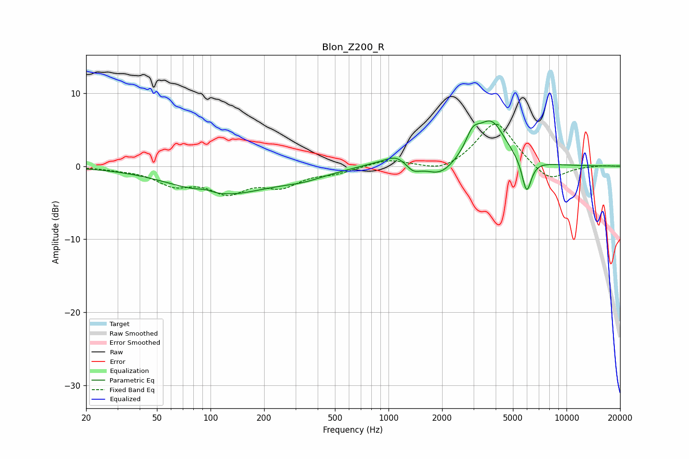

# Blon_Z200_R
See [usage instructions](https://github.com/jaakkopasanen/AutoEq#usage) for more options and info.

### Parametric EQs
Apply preamp of -6.3 dB when using parametric equalizer.

|   # | Type    |   Fc (Hz) |    Q |   Gain (dB) |
|-----|---------|-----------|------|-------------|
|   1 | Peaking |        93 | 3.02 |         0.4 |
|   2 | Peaking |       116 | 0.53 |        -3.8 |
|   3 | Peaking |       332 | 1.06 |        -0.9 |
|   4 | Peaking |       826 | 1.34 |         0.4 |
|   5 | Peaking |      1107 | 2.25 |         1.4 |
|   6 | Peaking |      1372 | 3.58 |        -1.1 |
|   7 | Peaking |      1955 | 1.83 |        -1.8 |
|   8 | Peaking |      2967 | 3.51 |         2.6 |
|   9 | Peaking |      3781 | 1.71 |         5.9 |
|  10 | Peaking |      5970 | 5.23 |        -4.7 |

### Fixed Band EQs
When using fixed band (also called graphic) equalizer, apply preamp of **-5.8 dB** (if available) and set gains manually with these parameters.

|   # | Type    |   Fc (Hz) |    Q |   Gain (dB) |
|-----|---------|-----------|------|-------------|
|   1 | Peaking |        31 | 1.41 |        -0.3 |
|   2 | Peaking |        62 | 1.41 |        -2.2 |
|   3 | Peaking |       125 | 1.41 |        -3.2 |
|   4 | Peaking |       250 | 1.41 |        -2.4 |
|   5 | Peaking |       500 | 1.41 |        -0.8 |
|   6 | Peaking |      1000 | 1.41 |         1   |
|   7 | Peaking |      2000 | 1.41 |        -1   |
|   8 | Peaking |      4000 | 1.41 |         6.2 |
|   9 | Peaking |      8000 | 1.41 |        -2.3 |
|  10 | Peaking |     16000 | 1.41 |         0.1 |

### Graphs

