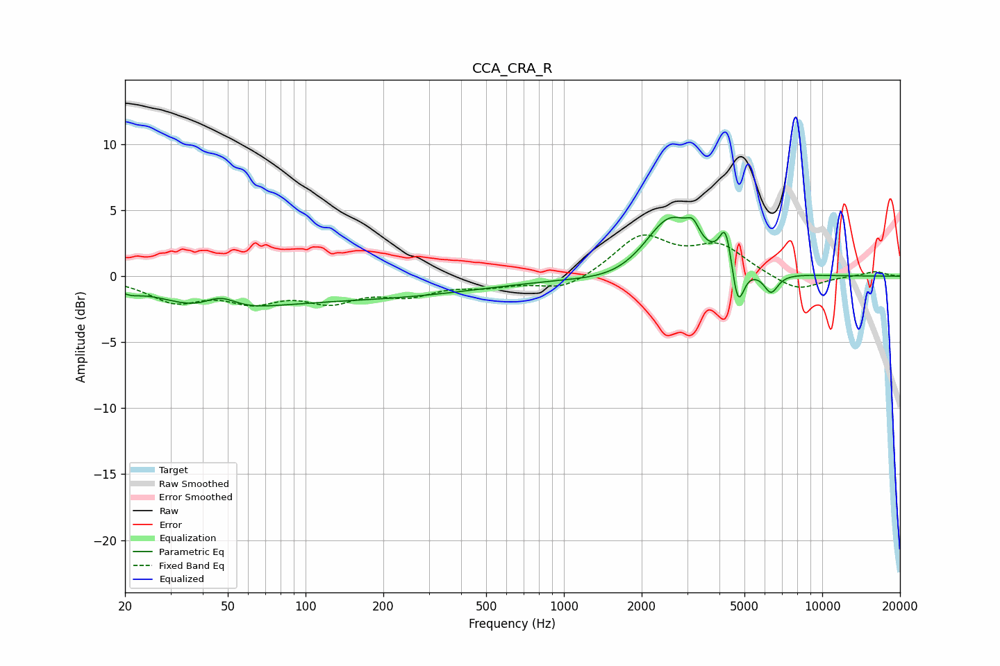

# CCA_CRA_R
See [usage instructions](https://github.com/jaakkopasanen/AutoEq#usage) for more options and info.

### Parametric EQs
Apply preamp of -4.6 dB when using parametric equalizer.

|   # | Type    |   Fc (Hz) |    Q |   Gain (dB) |
|-----|---------|-----------|------|-------------|
|   1 | Peaking |        21 | 3.37 |        -0.4 |
|   2 | Peaking |        44 | 0.86 |        -2.2 |
|   3 | Peaking |        47 | 1.99 |         1.5 |
|   4 | Peaking |       144 | 0.28 |        -1.6 |
|   5 | Peaking |      1653 | 0.97 |        -0.7 |
|   6 | Peaking |      2580 | 1.42 |         4.7 |
|   7 | Peaking |      3160 | 5.85 |         1.1 |
|   8 | Peaking |      4230 | 6    |         3.1 |
|   9 | Peaking |      4713 | 6    |        -3.4 |
|  10 | Peaking |      6333 | 4.96 |        -1.5 |

### Fixed Band EQs
When using fixed band (also called graphic) equalizer, apply preamp of **-3.2 dB** (if available) and set gains manually with these parameters.

|   # | Type    |   Fc (Hz) |    Q |   Gain (dB) |
|-----|---------|-----------|------|-------------|
|   1 | Peaking |        31 | 1.41 |        -1.7 |
|   2 | Peaking |        62 | 1.41 |        -1.6 |
|   3 | Peaking |       125 | 1.41 |        -1.6 |
|   4 | Peaking |       250 | 1.41 |        -1.2 |
|   5 | Peaking |       500 | 1.41 |        -0.6 |
|   6 | Peaking |      1000 | 1.41 |        -1.1 |
|   7 | Peaking |      2000 | 1.41 |         3   |
|   8 | Peaking |      4000 | 1.41 |         2.2 |
|   9 | Peaking |      8000 | 1.41 |        -1.2 |
|  10 | Peaking |     16000 | 1.41 |         0.4 |

### Graphs

