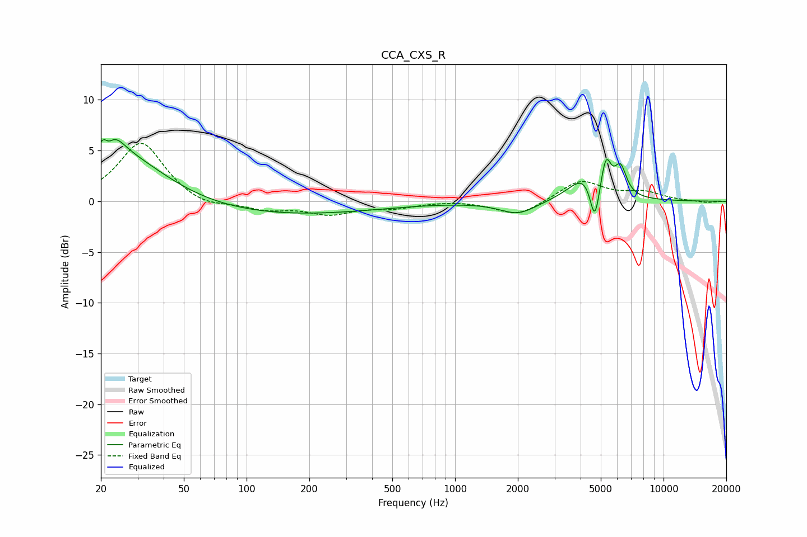

# CCA_CXS_R
See [usage instructions](https://github.com/jaakkopasanen/AutoEq#usage) for more options and info.

### Parametric EQs
Apply preamp of -6.2 dB when using parametric equalizer.

|   # | Type    |   Fc (Hz) |    Q |   Gain (dB) |
|-----|---------|-----------|------|-------------|
|   1 | Peaking |        21 | 5.67 |         3.3 |
|   2 | Peaking |        21 | 5.85 |        -3   |
|   3 | Peaking |        23 | 2.75 |         1.8 |
|   4 | Peaking |        25 | 0.62 |         5   |
|   5 | Peaking |       112 | 0.25 |        -1.5 |
|   6 | Peaking |      2006 | 1.62 |        -1.3 |
|   7 | Peaking |      4212 | 1.86 |         2.6 |
|   8 | Peaking |      4681 | 6    |        -4.3 |
|   9 | Peaking |      5294 | 5.81 |         3.3 |
|  10 | Peaking |      6221 | 4.88 |         2.7 |

### Fixed Band EQs
When using fixed band (also called graphic) equalizer, apply preamp of **-5.8 dB** (if available) and set gains manually with these parameters.

|   # | Type    |   Fc (Hz) |    Q |   Gain (dB) |
|-----|---------|-----------|------|-------------|
|   1 | Peaking |        31 | 1.41 |         5.9 |
|   2 | Peaking |        62 | 1.41 |        -0.8 |
|   3 | Peaking |       125 | 1.41 |        -0.8 |
|   4 | Peaking |       250 | 1.41 |        -1.2 |
|   5 | Peaking |       500 | 1.41 |        -0.6 |
|   6 | Peaking |      1000 | 1.41 |         0.1 |
|   7 | Peaking |      2000 | 1.41 |        -1.5 |
|   8 | Peaking |      4000 | 1.41 |         2.1 |
|   9 | Peaking |      8000 | 1.41 |         0.8 |
|  10 | Peaking |     16000 | 1.41 |        -0.2 |

### Graphs

