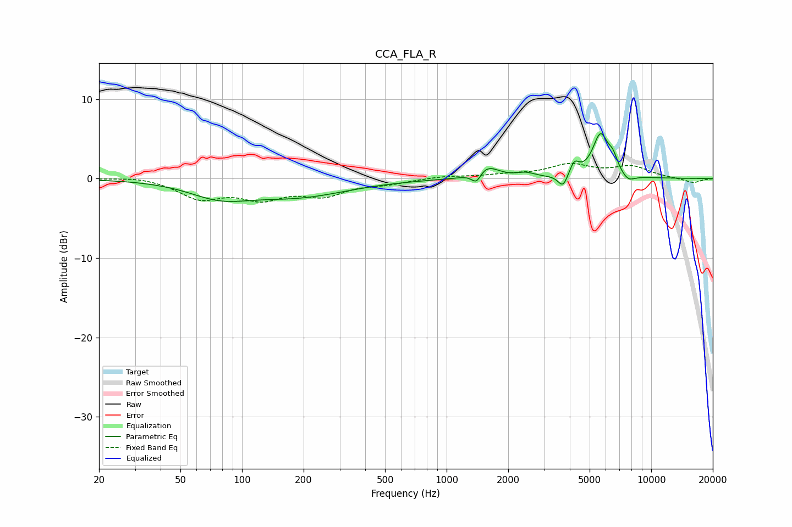

# CCA_FLA_R
See [usage instructions](https://github.com/jaakkopasanen/AutoEq#usage) for more options and info.

### Parametric EQs
Apply preamp of -5.8 dB when using parametric equalizer.

|   # | Type    |   Fc (Hz) |    Q |   Gain (dB) |
|-----|---------|-----------|------|-------------|
|   1 | Peaking |        78 | 0.95 |        -1.9 |
|   2 | Peaking |       189 | 0.57 |        -2.1 |
|   3 | Peaking |      1399 | 6    |        -1.4 |
|   4 | Peaking |      1569 | 2.55 |         1.6 |
|   5 | Peaking |      2434 | 3.16 |         0.5 |
|   6 | Peaking |      3706 | 6    |        -1.7 |
|   7 | Peaking |      4211 | 6    |         1.6 |
|   8 | Peaking |      5653 | 3.55 |         5.4 |
|   9 | Peaking |      6508 | 5.99 |         1.5 |
|  10 | Peaking |      7706 | 4.04 |        -0.9 |

### Fixed Band EQs
When using fixed band (also called graphic) equalizer, apply preamp of **-2.0 dB** (if available) and set gains manually with these parameters.

|   # | Type    |   Fc (Hz) |    Q |   Gain (dB) |
|-----|---------|-----------|------|-------------|
|   1 | Peaking |        31 | 1.41 |         0.3 |
|   2 | Peaking |        62 | 1.41 |        -2.3 |
|   3 | Peaking |       125 | 1.41 |        -2.2 |
|   4 | Peaking |       250 | 1.41 |        -1.9 |
|   5 | Peaking |       500 | 1.41 |        -0.5 |
|   6 | Peaking |      1000 | 1.41 |         0.3 |
|   7 | Peaking |      2000 | 1.41 |         0.4 |
|   8 | Peaking |      4000 | 1.41 |         1.6 |
|   9 | Peaking |      8000 | 1.41 |         1.4 |
|  10 | Peaking |     16000 | 1.41 |        -0.6 |

### Graphs

