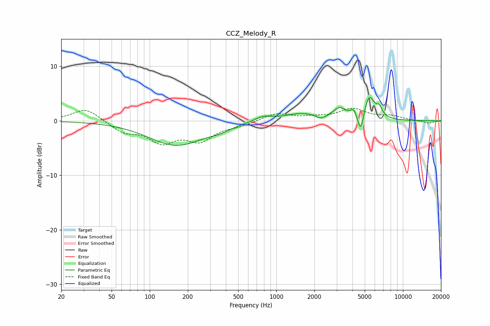

# CCZ_Melody_R
See [usage instructions](https://github.com/jaakkopasanen/AutoEq#usage) for more options and info.

### Parametric EQs
Apply preamp of -4.4 dB when using parametric equalizer.

|   # | Type    |   Fc (Hz) |    Q |   Gain (dB) |
|-----|---------|-----------|------|-------------|
|   1 | Peaking |       162 | 0.65 |        -4.5 |
|   2 | Peaking |       355 | 1.71 |        -0.6 |
|   3 | Peaking |       786 | 2.02 |         0.9 |
|   4 | Peaking |      1632 | 0.97 |         1.4 |
|   5 | Peaking |      2250 | 3.27 |        -0.9 |
|   6 | Peaking |      3166 | 2.81 |         1.9 |
|   7 | Peaking |      4086 | 6    |         1.3 |
|   8 | Peaking |      4642 | 6    |        -3.9 |
|   9 | Peaking |      5411 | 3.29 |         4.5 |
|  10 | Peaking |      6522 | 6    |         1.5 |

### Fixed Band EQs
When using fixed band (also called graphic) equalizer, apply preamp of **-2.4 dB** (if available) and set gains manually with these parameters.

|   # | Type    |   Fc (Hz) |    Q |   Gain (dB) |
|-----|---------|-----------|------|-------------|
|   1 | Peaking |        31 | 1.41 |         2.4 |
|   2 | Peaking |        62 | 1.41 |        -1.9 |
|   3 | Peaking |       125 | 1.41 |        -3.5 |
|   4 | Peaking |       250 | 1.41 |        -3.3 |
|   5 | Peaking |       500 | 1.41 |        -0.7 |
|   6 | Peaking |      1000 | 1.41 |         1.4 |
|   7 | Peaking |      2000 | 1.41 |         0.5 |
|   8 | Peaking |      4000 | 1.41 |         2.1 |
|   9 | Peaking |      8000 | 1.41 |         0.8 |
|  10 | Peaking |     16000 | 1.41 |        -0.4 |

### Graphs

