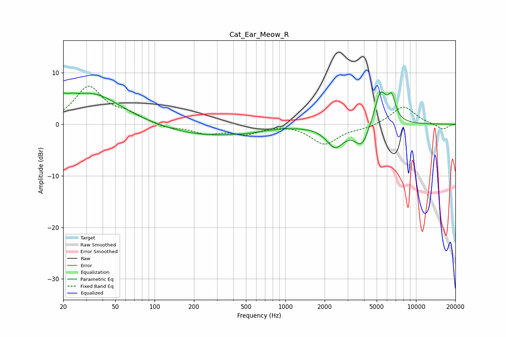

# Cat_Ear_Meow_R
See [usage instructions](https://github.com/jaakkopasanen/AutoEq#usage) for more options and info.

### Parametric EQs
Apply preamp of -6.3 dB when using parametric equalizer.

|   # | Type    |   Fc (Hz) |    Q |   Gain (dB) |
|-----|---------|-----------|------|-------------|
|   1 | Peaking |        20 | 5.7  |         3.3 |
|   2 | Peaking |        21 | 5.99 |        -2.4 |
|   3 | Peaking |        22 | 2.52 |         1.3 |
|   4 | Peaking |        33 | 0.65 |         5.9 |
|   5 | Peaking |       258 | 0.42 |        -2.2 |
|   6 | Peaking |       527 | 1.98 |        -0.2 |
|   7 | Peaking |      2401 | 2.12 |        -4.1 |
|   8 | Peaking |      3862 | 2.5  |        -4.3 |
|   9 | Peaking |      5350 | 2.84 |         6.7 |
|  10 | Peaking |      6521 | 4.8  |         4   |

### Fixed Band EQs
When using fixed band (also called graphic) equalizer, apply preamp of **-7.5 dB** (if available) and set gains manually with these parameters.

|   # | Type    |   Fc (Hz) |    Q |   Gain (dB) |
|-----|---------|-----------|------|-------------|
|   1 | Peaking |        31 | 1.41 |         7.1 |
|   2 | Peaking |        62 | 1.41 |         1.6 |
|   3 | Peaking |       125 | 1.41 |        -0.8 |
|   4 | Peaking |       250 | 1.41 |        -1.6 |
|   5 | Peaking |       500 | 1.41 |        -1.7 |
|   6 | Peaking |      1000 | 1.41 |         0.2 |
|   7 | Peaking |      2000 | 1.41 |        -3.8 |
|   8 | Peaking |      4000 | 1.41 |        -0.6 |
|   9 | Peaking |      8000 | 1.41 |         3.6 |
|  10 | Peaking |     16000 | 1.41 |        -1.1 |

### Graphs

