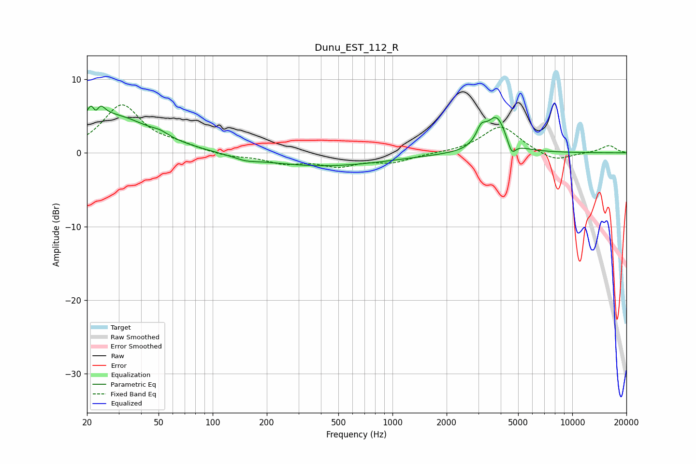

# Dunu_EST_112_R
See [usage instructions](https://github.com/jaakkopasanen/AutoEq#usage) for more options and info.

### Parametric EQs
Apply preamp of -6.4 dB when using parametric equalizer.

|   # | Type    |   Fc (Hz) |    Q |   Gain (dB) |
|-----|---------|-----------|------|-------------|
|   1 | Peaking |        21 | 5.65 |         3.4 |
|   2 | Peaking |        22 | 5.8  |        -3.1 |
|   3 | Peaking |        24 | 5.41 |         2.2 |
|   4 | Peaking |        28 | 0.67 |         5   |
|   5 | Peaking |        51 | 3.26 |         0.5 |
|   6 | Peaking |       153 | 2.34 |        -0.4 |
|   7 | Peaking |       402 | 0.38 |        -1.8 |
|   8 | Peaking |      3113 | 5.1  |         2   |
|   9 | Peaking |      3791 | 2.55 |         4.8 |
|  10 | Peaking |      4601 | 6    |        -2   |

### Fixed Band EQs
When using fixed band (also called graphic) equalizer, apply preamp of **-6.6 dB** (if available) and set gains manually with these parameters.

|   # | Type    |   Fc (Hz) |    Q |   Gain (dB) |
|-----|---------|-----------|------|-------------|
|   1 | Peaking |        31 | 1.41 |         6.4 |
|   2 | Peaking |        62 | 1.41 |         0.8 |
|   3 | Peaking |       125 | 1.41 |        -0.5 |
|   4 | Peaking |       250 | 1.41 |        -1.3 |
|   5 | Peaking |       500 | 1.41 |        -1.6 |
|   6 | Peaking |      1000 | 1.41 |        -1.2 |
|   7 | Peaking |      2000 | 1.41 |        -0   |
|   8 | Peaking |      4000 | 1.41 |         3.7 |
|   9 | Peaking |      8000 | 1.41 |        -1.3 |
|  10 | Peaking |     16000 | 1.41 |         1   |

### Graphs

