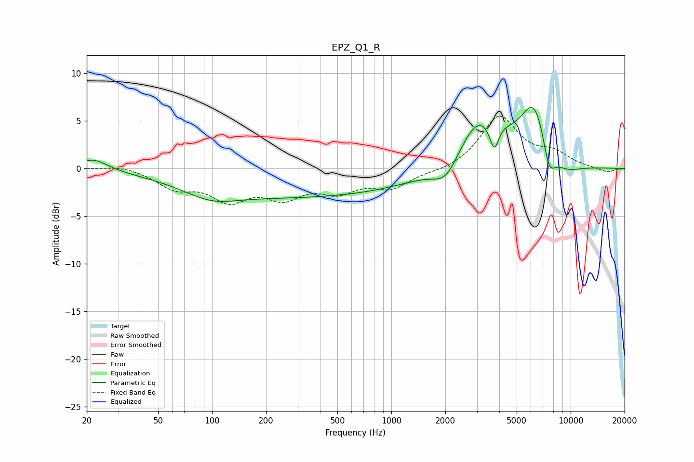

# EPZ_Q1_R
See [usage instructions](https://github.com/jaakkopasanen/AutoEq#usage) for more options and info.

### Parametric EQs
Apply preamp of -6.5 dB when using parametric equalizer.

|   # | Type    |   Fc (Hz) |    Q |   Gain (dB) |
|-----|---------|-----------|------|-------------|
|   1 | Peaking |        22 | 1.82 |         1.2 |
|   2 | Peaking |        99 | 0.99 |        -1.2 |
|   3 | Peaking |       313 | 0.21 |        -2.9 |
|   4 | Peaking |      2015 | 2.05 |        -2.1 |
|   5 | Peaking |      3052 | 1.26 |         5.1 |
|   6 | Peaking |      3753 | 5.25 |        -3.1 |
|   7 | Peaking |      4014 | 2.48 |         0.9 |
|   8 | Peaking |      6330 | 1.59 |         7.1 |
|   9 | Peaking |      7559 | 3.49 |        -3.7 |
|  10 | Peaking |      9137 | 1.36 |        -1.5 |

### Fixed Band EQs
When using fixed band (also called graphic) equalizer, apply preamp of **-5.6 dB** (if available) and set gains manually with these parameters.

|   # | Type    |   Fc (Hz) |    Q |   Gain (dB) |
|-----|---------|-----------|------|-------------|
|   1 | Peaking |        31 | 1.41 |         0.4 |
|   2 | Peaking |        62 | 1.41 |        -1.8 |
|   3 | Peaking |       125 | 1.41 |        -2.9 |
|   4 | Peaking |       250 | 1.41 |        -2.5 |
|   5 | Peaking |       500 | 1.41 |        -2   |
|   6 | Peaking |      1000 | 1.41 |        -1.9 |
|   7 | Peaking |      2000 | 1.41 |        -0.3 |
|   8 | Peaking |      4000 | 1.41 |         5.4 |
|   9 | Peaking |      8000 | 1.41 |         1.4 |
|  10 | Peaking |     16000 | 1.41 |        -0.5 |

### Graphs

