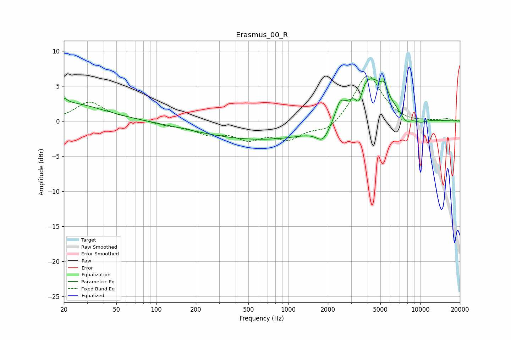

# Erasmus_00_R
See [usage instructions](https://github.com/jaakkopasanen/AutoEq#usage) for more options and info.

### Parametric EQs
Apply preamp of -6.1 dB when using parametric equalizer.

|   # | Type    |   Fc (Hz) |    Q |   Gain (dB) |
|-----|---------|-----------|------|-------------|
|   1 | Peaking |        20 | 5.82 |         0.8 |
|   2 | Peaking |        22 | 0.55 |         2.6 |
|   3 | Peaking |       700 | 0.27 |        -2.7 |
|   4 | Peaking |      1838 | 2.78 |        -2.2 |
|   5 | Peaking |      2470 | 4.38 |         2   |
|   6 | Peaking |      3442 | 5.83 |        -2.2 |
|   7 | Peaking |      4061 | 1.09 |         7.1 |
|   8 | Peaking |      5348 | 6    |         1.5 |
|   9 | Peaking |      7781 | 3.22 |        -1.3 |
|  10 | Peaking |     10000 | 2.16 |        -0.7 |

### Fixed Band EQs
When using fixed band (also called graphic) equalizer, apply preamp of **-6.5 dB** (if available) and set gains manually with these parameters.

|   # | Type    |   Fc (Hz) |    Q |   Gain (dB) |
|-----|---------|-----------|------|-------------|
|   1 | Peaking |        31 | 1.41 |         2.7 |
|   2 | Peaking |        62 | 1.41 |         0.3 |
|   3 | Peaking |       125 | 1.41 |        -0.5 |
|   4 | Peaking |       250 | 1.41 |        -1.6 |
|   5 | Peaking |       500 | 1.41 |        -2.2 |
|   6 | Peaking |      1000 | 1.41 |        -2.3 |
|   7 | Peaking |      2000 | 1.41 |        -1.6 |
|   8 | Peaking |      4000 | 1.41 |         6.8 |
|   9 | Peaking |      8000 | 1.41 |        -0.3 |
|  10 | Peaking |     16000 | 1.41 |         0.3 |

### Graphs

