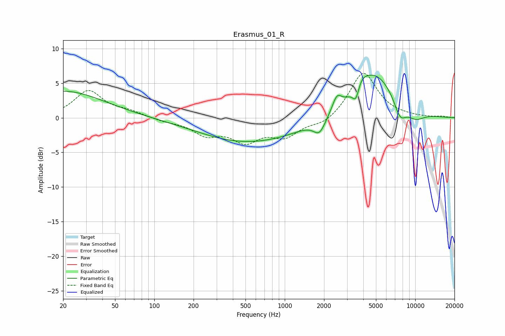

# Erasmus_01_R
See [usage instructions](https://github.com/jaakkopasanen/AutoEq#usage) for more options and info.

### Parametric EQs
Apply preamp of -6.3 dB when using parametric equalizer.

|   # | Type    |   Fc (Hz) |    Q |   Gain (dB) |
|-----|---------|-----------|------|-------------|
|   1 | Peaking |        20 | 0.45 |         3.9 |
|   2 | Peaking |       490 | 0.39 |        -3.4 |
|   3 | Peaking |      1073 | 0.74 |        -0.4 |
|   4 | Peaking |      1847 | 3.08 |        -2.2 |
|   5 | Peaking |      2510 | 4.05 |         2.1 |
|   6 | Peaking |      3514 | 5.37 |        -2.4 |
|   7 | Peaking |      3811 | 3.05 |         1.5 |
|   8 | Peaking |      4909 | 0.87 |         6.4 |
|   9 | Peaking |      7652 | 2.85 |        -2.7 |
|  10 | Peaking |     10000 | 1.71 |        -1.4 |

### Fixed Band EQs
When using fixed band (also called graphic) equalizer, apply preamp of **-6.5 dB** (if available) and set gains manually with these parameters.

|   # | Type    |   Fc (Hz) |    Q |   Gain (dB) |
|-----|---------|-----------|------|-------------|
|   1 | Peaking |        31 | 1.41 |         3.8 |
|   2 | Peaking |        62 | 1.41 |         0.8 |
|   3 | Peaking |       125 | 1.41 |        -0.4 |
|   4 | Peaking |       250 | 1.41 |        -2.2 |
|   5 | Peaking |       500 | 1.41 |        -3   |
|   6 | Peaking |      1000 | 1.41 |        -2.4 |
|   7 | Peaking |      2000 | 1.41 |        -1.1 |
|   8 | Peaking |      4000 | 1.41 |         6.7 |
|   9 | Peaking |      8000 | 1.41 |         0.1 |
|  10 | Peaking |     16000 | 1.41 |         0.2 |

### Graphs

