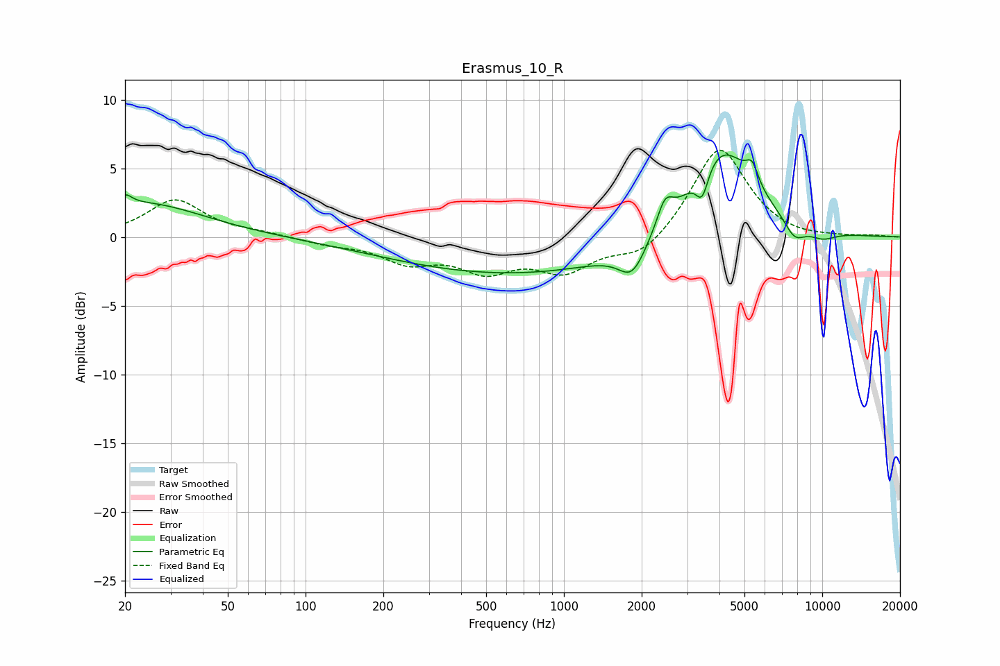

# Erasmus_10_R
See [usage instructions](https://github.com/jaakkopasanen/AutoEq#usage) for more options and info.

### Parametric EQs
Apply preamp of -6.1 dB when using parametric equalizer.

|   # | Type    |   Fc (Hz) |    Q |   Gain (dB) |
|-----|---------|-----------|------|-------------|
|   1 | Peaking |        20 | 5.38 |         0.8 |
|   2 | Peaking |        24 | 0.61 |         2.4 |
|   3 | Peaking |       681 | 0.27 |        -2.7 |
|   4 | Peaking |      1839 | 2.7  |        -2.2 |
|   5 | Peaking |      2462 | 4.53 |         1.9 |
|   6 | Peaking |      3431 | 5.88 |        -2.1 |
|   7 | Peaking |      4051 | 1.07 |         7   |
|   8 | Peaking |      5353 | 6    |         1.4 |
|   9 | Peaking |      7813 | 3.22 |        -1.4 |
|  10 | Peaking |     10000 | 2.21 |        -0.7 |

### Fixed Band EQs
When using fixed band (also called graphic) equalizer, apply preamp of **-6.4 dB** (if available) and set gains manually with these parameters.

|   # | Type    |   Fc (Hz) |    Q |   Gain (dB) |
|-----|---------|-----------|------|-------------|
|   1 | Peaking |        31 | 1.41 |         2.7 |
|   2 | Peaking |        62 | 1.41 |         0.3 |
|   3 | Peaking |       125 | 1.41 |        -0.4 |
|   4 | Peaking |       250 | 1.41 |        -1.6 |
|   5 | Peaking |       500 | 1.41 |        -2.2 |
|   6 | Peaking |      1000 | 1.41 |        -2.3 |
|   7 | Peaking |      2000 | 1.41 |        -1.5 |
|   8 | Peaking |      4000 | 1.41 |         6.7 |
|   9 | Peaking |      8000 | 1.41 |        -0.2 |
|  10 | Peaking |     16000 | 1.41 |         0.1 |

### Graphs

