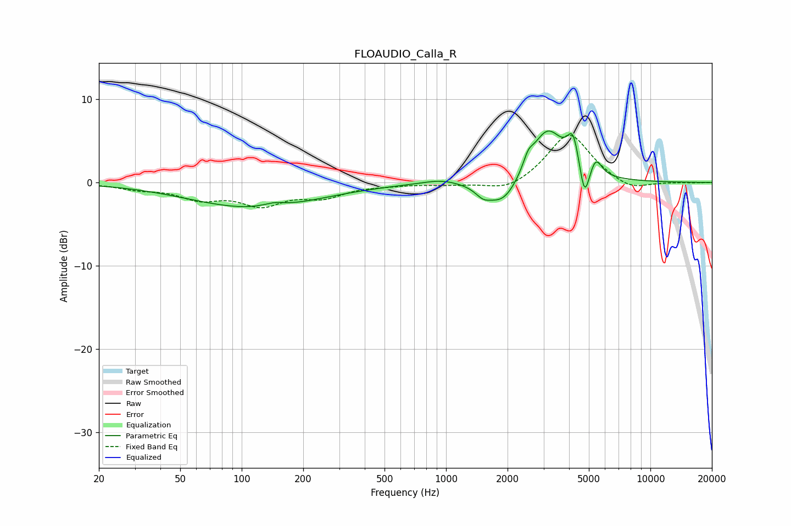

# FLOAUDIO_Calla_R
See [usage instructions](https://github.com/jaakkopasanen/AutoEq#usage) for more options and info.

### Parametric EQs
Apply preamp of -6.3 dB when using parametric equalizer.

|   # | Type    |   Fc (Hz) |    Q |   Gain (dB) |
|-----|---------|-----------|------|-------------|
|   1 | Peaking |       115 | 0.45 |        -3.1 |
|   2 | Peaking |       144 | 2.66 |         0.5 |
|   3 | Peaking |       947 | 1.55 |         0.5 |
|   4 | Peaking |      1515 | 3.86 |        -1   |
|   5 | Peaking |      1897 | 1.8  |        -3.2 |
|   6 | Peaking |      2524 | 5.88 |         1.4 |
|   7 | Peaking |      3129 | 1.73 |         6.4 |
|   8 | Peaking |      4181 | 5.03 |         3.8 |
|   9 | Peaking |      4763 | 6    |        -4.3 |
|  10 | Peaking |      5409 | 4.96 |         2.1 |

### Fixed Band EQs
When using fixed band (also called graphic) equalizer, apply preamp of **-5.8 dB** (if available) and set gains manually with these parameters.

|   # | Type    |   Fc (Hz) |    Q |   Gain (dB) |
|-----|---------|-----------|------|-------------|
|   1 | Peaking |        31 | 1.41 |        -0.6 |
|   2 | Peaking |        62 | 1.41 |        -1.7 |
|   3 | Peaking |       125 | 1.41 |        -2.4 |
|   4 | Peaking |       250 | 1.41 |        -1.5 |
|   5 | Peaking |       500 | 1.41 |        -0.2 |
|   6 | Peaking |      1000 | 1.41 |        -0.2 |
|   7 | Peaking |      2000 | 1.41 |        -1.2 |
|   8 | Peaking |      4000 | 1.41 |         6   |
|   9 | Peaking |      8000 | 1.41 |        -1.1 |
|  10 | Peaking |     16000 | 1.41 |        -0   |

### Graphs

