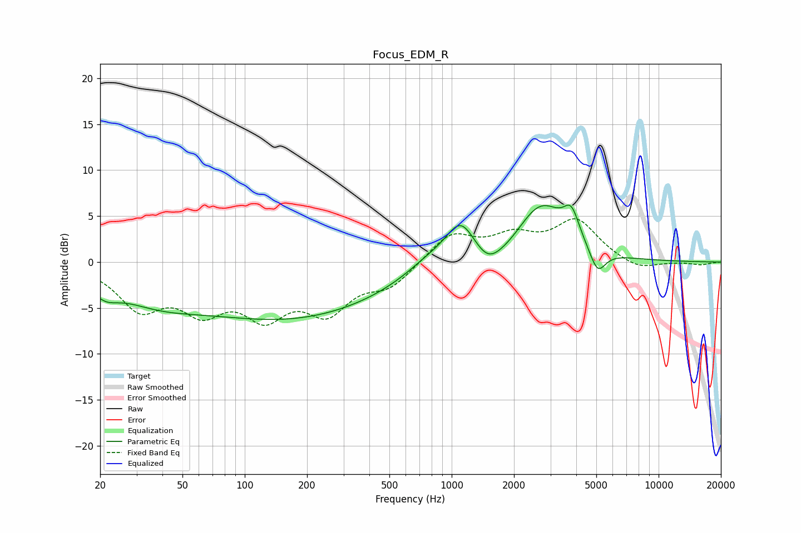

# Focus_EDM_R
See [usage instructions](https://github.com/jaakkopasanen/AutoEq#usage) for more options and info.

### Parametric EQs
Apply preamp of -6.3 dB when using parametric equalizer.

|   # | Type    |   Fc (Hz) |    Q |   Gain (dB) |
|-----|---------|-----------|------|-------------|
|   1 | Peaking |        21 | 2.24 |        -1.5 |
|   2 | Peaking |        36 | 0.65 |        -2.8 |
|   3 | Peaking |       168 | 0.3  |        -5.9 |
|   4 | Peaking |       770 | 1.19 |         1.5 |
|   5 | Peaking |      1105 | 1.97 |         4.3 |
|   6 | Peaking |      1498 | 2.16 |        -2   |
|   7 | Peaking |      1880 | 1.7  |        -0.7 |
|   8 | Peaking |      2702 | 1.18 |         6.2 |
|   9 | Peaking |      3790 | 3.78 |         3   |
|  10 | Peaking |      5072 | 3.62 |        -2.7 |

### Fixed Band EQs
When using fixed band (also called graphic) equalizer, apply preamp of **-4.8 dB** (if available) and set gains manually with these parameters.

|   # | Type    |   Fc (Hz) |    Q |   Gain (dB) |
|-----|---------|-----------|------|-------------|
|   1 | Peaking |        31 | 1.41 |        -4.6 |
|   2 | Peaking |        62 | 1.41 |        -4.4 |
|   3 | Peaking |       125 | 1.41 |        -5   |
|   4 | Peaking |       250 | 1.41 |        -4.8 |
|   5 | Peaking |       500 | 1.41 |        -2.4 |
|   6 | Peaking |      1000 | 1.41 |         3.1 |
|   7 | Peaking |      2000 | 1.41 |         2.4 |
|   8 | Peaking |      4000 | 1.41 |         4.3 |
|   9 | Peaking |      8000 | 1.41 |        -1   |
|  10 | Peaking |     16000 | 1.41 |        -0.3 |

### Graphs

