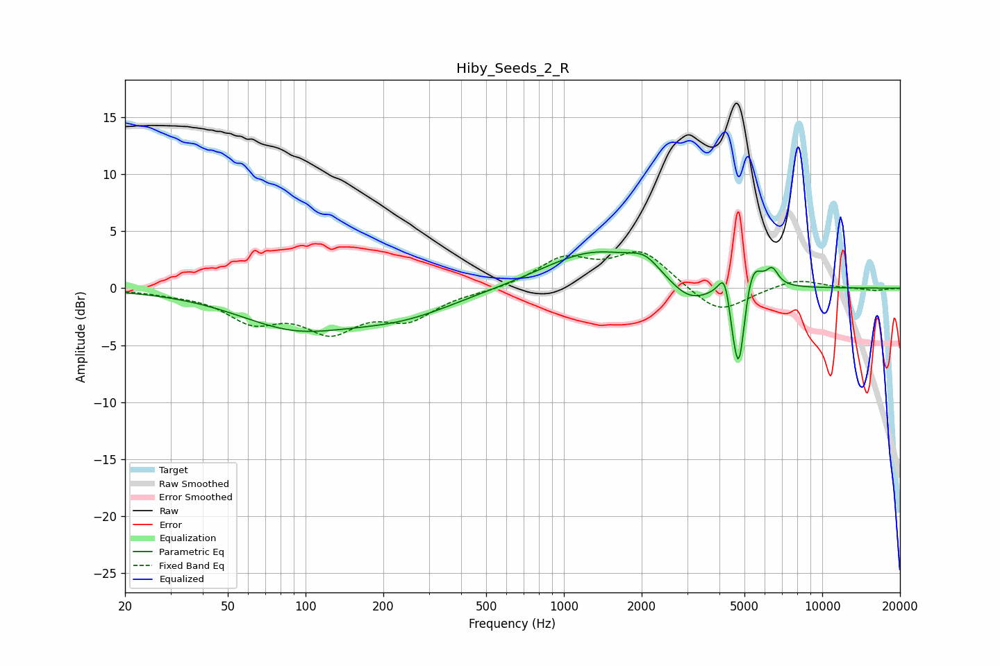

# Hiby_Seeds_2_R
See [usage instructions](https://github.com/jaakkopasanen/AutoEq#usage) for more options and info.

### Parametric EQs
Apply preamp of -3.3 dB when using parametric equalizer.

|   # | Type    |   Fc (Hz) |    Q |   Gain (dB) |
|-----|---------|-----------|------|-------------|
|   1 | Peaking |        90 | 0.63 |        -3.1 |
|   2 | Peaking |       235 | 0.64 |        -2.1 |
|   3 | Peaking |      1318 | 0.71 |         3.3 |
|   4 | Peaking |      2062 | 2.4  |         1.3 |
|   5 | Peaking |      3057 | 1.68 |        -1.9 |
|   6 | Peaking |      4208 | 5.99 |         2.8 |
|   7 | Peaking |      4521 | 6    |        -1.9 |
|   8 | Peaking |      4765 | 6    |        -7.2 |
|   9 | Peaking |      5351 | 3.95 |         2.9 |
|  10 | Peaking |      6408 | 5.96 |         1.4 |

### Fixed Band EQs
When using fixed band (also called graphic) equalizer, apply preamp of **-3.3 dB** (if available) and set gains manually with these parameters.

|   # | Type    |   Fc (Hz) |    Q |   Gain (dB) |
|-----|---------|-----------|------|-------------|
|   1 | Peaking |        31 | 1.41 |        -0.3 |
|   2 | Peaking |        62 | 1.41 |        -2.6 |
|   3 | Peaking |       125 | 1.41 |        -3.3 |
|   4 | Peaking |       250 | 1.41 |        -2.4 |
|   5 | Peaking |       500 | 1.41 |        -0.2 |
|   6 | Peaking |      1000 | 1.41 |         2.5 |
|   7 | Peaking |      2000 | 1.41 |         3.1 |
|   8 | Peaking |      4000 | 1.41 |        -2.4 |
|   9 | Peaking |      8000 | 1.41 |         0.8 |
|  10 | Peaking |     16000 | 1.41 |        -0.2 |

### Graphs

