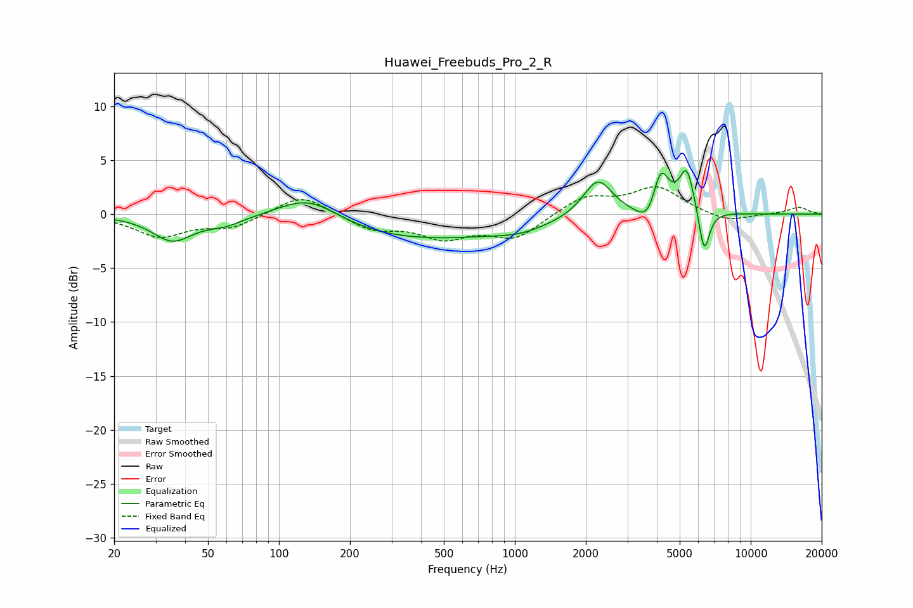

# Huawei_Freebuds_Pro_2_R
See [usage instructions](https://github.com/jaakkopasanen/AutoEq#usage) for more options and info.

### Parametric EQs
Apply preamp of -4.1 dB when using parametric equalizer.

|   # | Type    |   Fc (Hz) |    Q |   Gain (dB) |
|-----|---------|-----------|------|-------------|
|   1 | Peaking |        35 | 1.66 |        -2.3 |
|   2 | Peaking |        59 | 1.85 |        -0.7 |
|   3 | Peaking |       133 | 1.04 |         2.7 |
|   4 | Peaking |       367 | 0.32 |        -2.4 |
|   5 | Peaking |      1060 | 1.31 |        -0.6 |
|   6 | Peaking |      2249 | 2.25 |         3.6 |
|   7 | Peaking |      3743 | 3    |        -2.4 |
|   8 | Peaking |      4137 | 3.8  |         4.8 |
|   9 | Peaking |      5360 | 4.33 |         4.1 |
|  10 | Peaking |      6346 | 6    |        -4.3 |

### Fixed Band EQs
When using fixed band (also called graphic) equalizer, apply preamp of **-2.6 dB** (if available) and set gains manually with these parameters.

|   # | Type    |   Fc (Hz) |    Q |   Gain (dB) |
|-----|---------|-----------|------|-------------|
|   1 | Peaking |        31 | 1.41 |        -2   |
|   2 | Peaking |        62 | 1.41 |        -1.2 |
|   3 | Peaking |       125 | 1.41 |         2   |
|   4 | Peaking |       250 | 1.41 |        -1.4 |
|   5 | Peaking |       500 | 1.41 |        -2   |
|   6 | Peaking |      1000 | 1.41 |        -2.2 |
|   7 | Peaking |      2000 | 1.41 |         1.7 |
|   8 | Peaking |      4000 | 1.41 |         2.4 |
|   9 | Peaking |      8000 | 1.41 |        -0.8 |
|  10 | Peaking |     16000 | 1.41 |         0.6 |

### Graphs

