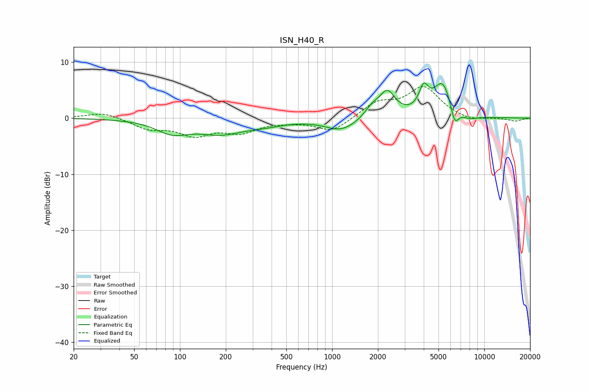

# ISN_H40_R
See [usage instructions](https://github.com/jaakkopasanen/AutoEq#usage) for more options and info.

### Parametric EQs
Apply preamp of -6.4 dB when using parametric equalizer.

|   # | Type    |   Fc (Hz) |    Q |   Gain (dB) |
|-----|---------|-----------|------|-------------|
|   1 | Peaking |        89 | 1.32 |        -2.3 |
|   2 | Peaking |       185 | 0.96 |        -2.3 |
|   3 | Peaking |       357 | 1.03 |        -0.9 |
|   4 | Peaking |      1147 | 1.36 |        -2.2 |
|   5 | Peaking |      1831 | 3    |         1.7 |
|   6 | Peaking |      2304 | 2.72 |         4.4 |
|   7 | Peaking |      4001 | 4.62 |         3.9 |
|   8 | Peaking |      5347 | 2.17 |         6.4 |
|   9 | Peaking |      6376 | 4.76 |        -3.7 |
|  10 | Peaking |      7917 | 2.37 |        -0.9 |

### Fixed Band EQs
When using fixed band (also called graphic) equalizer, apply preamp of **-5.8 dB** (if available) and set gains manually with these parameters.

|   # | Type    |   Fc (Hz) |    Q |   Gain (dB) |
|-----|---------|-----------|------|-------------|
|   1 | Peaking |        31 | 1.41 |         1.1 |
|   2 | Peaking |        62 | 1.41 |        -1.7 |
|   3 | Peaking |       125 | 1.41 |        -2.7 |
|   4 | Peaking |       250 | 1.41 |        -2.2 |
|   5 | Peaking |       500 | 1.41 |        -0.4 |
|   6 | Peaking |      1000 | 1.41 |        -2.4 |
|   7 | Peaking |      2000 | 1.41 |         2.6 |
|   8 | Peaking |      4000 | 1.41 |         5.4 |
|   9 | Peaking |      8000 | 1.41 |        -0.6 |
|  10 | Peaking |     16000 | 1.41 |        -0.5 |

### Graphs

