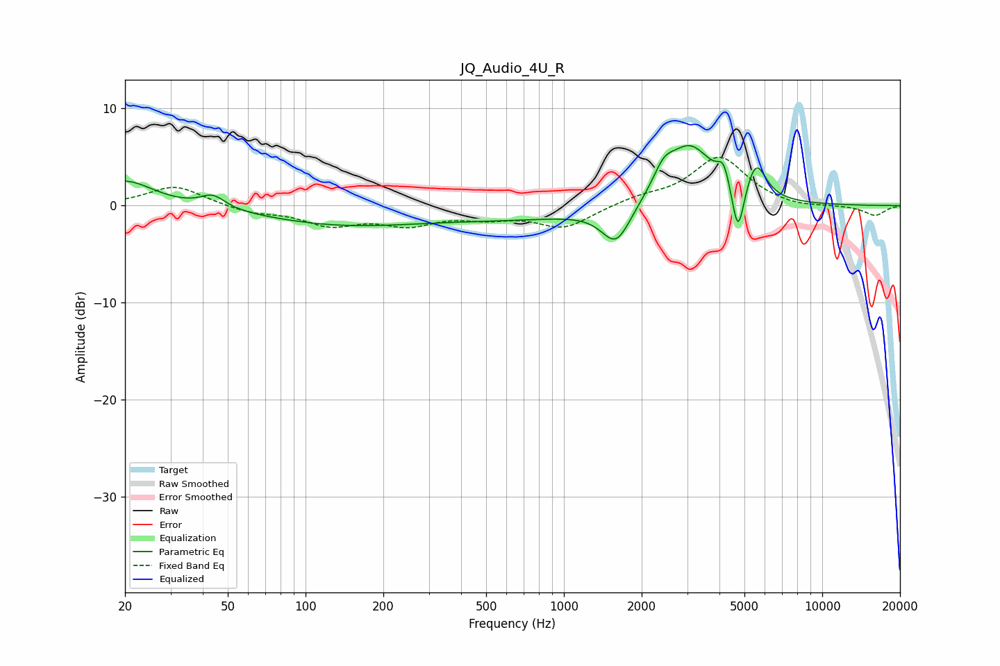

# JQ_Audio_4U_R
See [usage instructions](https://github.com/jaakkopasanen/AutoEq#usage) for more options and info.

### Parametric EQs
Apply preamp of -6.3 dB when using parametric equalizer.

|   # | Type    |   Fc (Hz) |    Q |   Gain (dB) |
|-----|---------|-----------|------|-------------|
|   1 | Peaking |        20 | 1.28 |         2.6 |
|   2 | Peaking |        44 | 2.98 |         1.3 |
|   3 | Peaking |       138 | 0.46 |        -1.8 |
|   4 | Peaking |       707 | 0.42 |        -1.2 |
|   5 | Peaking |      1593 | 2.53 |        -3.9 |
|   6 | Peaking |      2431 | 3.44 |         2.1 |
|   7 | Peaking |      3078 | 1.54 |         6.1 |
|   8 | Peaking |      4151 | 6    |         2.2 |
|   9 | Peaking |      4720 | 6    |        -5.5 |
|  10 | Peaking |      5547 | 3.63 |         3.7 |

### Fixed Band EQs
When using fixed band (also called graphic) equalizer, apply preamp of **-5.1 dB** (if available) and set gains manually with these parameters.

|   # | Type    |   Fc (Hz) |    Q |   Gain (dB) |
|-----|---------|-----------|------|-------------|
|   1 | Peaking |        31 | 1.41 |         2.1 |
|   2 | Peaking |        62 | 1.41 |        -0.7 |
|   3 | Peaking |       125 | 1.41 |        -1.8 |
|   4 | Peaking |       250 | 1.41 |        -1.7 |
|   5 | Peaking |       500 | 1.41 |        -1   |
|   6 | Peaking |      1000 | 1.41 |        -2.2 |
|   7 | Peaking |      2000 | 1.41 |         0.7 |
|   8 | Peaking |      4000 | 1.41 |         5   |
|   9 | Peaking |      8000 | 1.41 |        -0.3 |
|  10 | Peaking |     16000 | 1.41 |        -1   |

### Graphs

