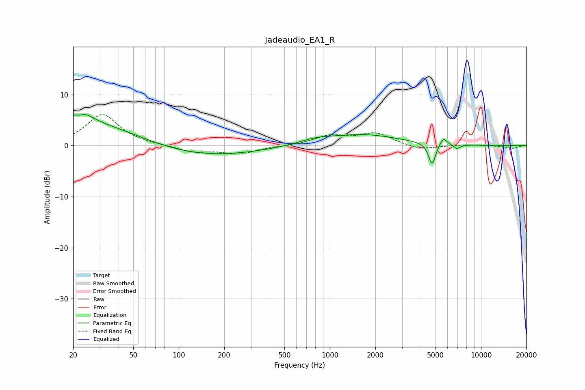

# Jadeaudio_EA1_R
See [usage instructions](https://github.com/jaakkopasanen/AutoEq#usage) for more options and info.

### Parametric EQs
Apply preamp of -6.2 dB when using parametric equalizer.

|   # | Type    |   Fc (Hz) |    Q |   Gain (dB) |
|-----|---------|-----------|------|-------------|
|   1 | Peaking |        21 | 5.79 |         3.2 |
|   2 | Peaking |        21 | 5.95 |        -2.7 |
|   3 | Peaking |        24 | 0.41 |         4.9 |
|   4 | Peaking |        24 | 2.54 |         1.5 |
|   5 | Peaking |       141 | 0.38 |        -2.2 |
|   6 | Peaking |       800 | 1.35 |         0.8 |
|   7 | Peaking |      1640 | 0.59 |         2.1 |
|   8 | Peaking |      4746 | 6    |        -4.3 |
|   9 | Peaking |      5642 | 5.96 |         1.5 |
|  10 | Peaking |      6940 | 5.99 |        -0.8 |

### Fixed Band EQs
When using fixed band (also called graphic) equalizer, apply preamp of **-6.2 dB** (if available) and set gains manually with these parameters.

|   # | Type    |   Fc (Hz) |    Q |   Gain (dB) |
|-----|---------|-----------|------|-------------|
|   1 | Peaking |        31 | 1.41 |         6.1 |
|   2 | Peaking |        62 | 1.41 |         0.1 |
|   3 | Peaking |       125 | 1.41 |        -1.2 |
|   4 | Peaking |       250 | 1.41 |        -1.5 |
|   5 | Peaking |       500 | 1.41 |        -0.1 |
|   6 | Peaking |      1000 | 1.41 |         1.8 |
|   7 | Peaking |      2000 | 1.41 |         2.3 |
|   8 | Peaking |      4000 | 1.41 |        -0.9 |
|   9 | Peaking |      8000 | 1.41 |         0.2 |
|  10 | Peaking |     16000 | 1.41 |        -0.5 |

### Graphs

