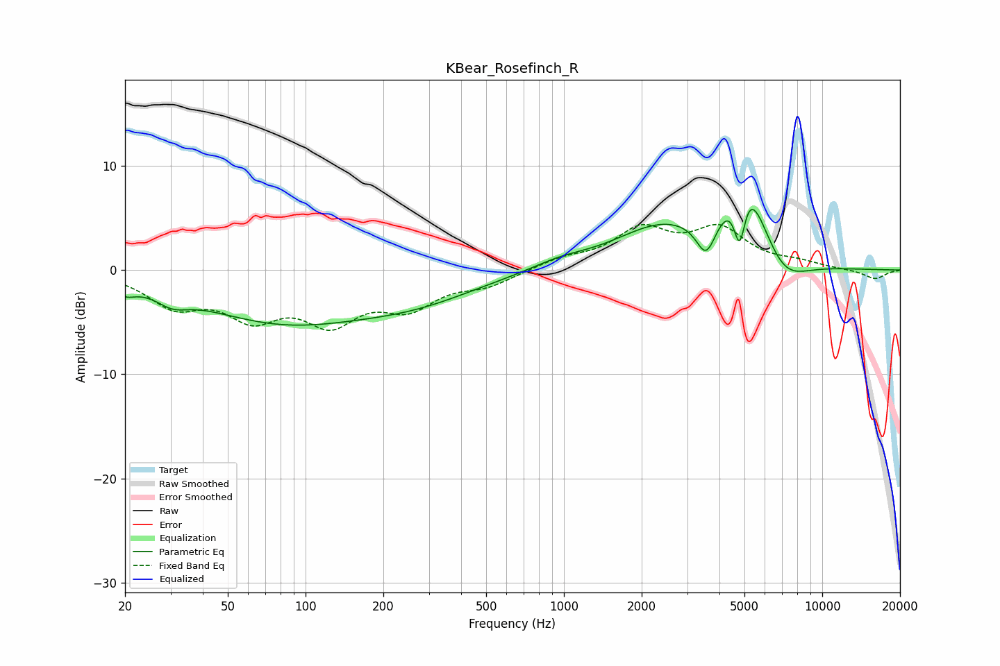

# KBear_Rosefinch_R
See [usage instructions](https://github.com/jaakkopasanen/AutoEq#usage) for more options and info.

### Parametric EQs
Apply preamp of -5.9 dB when using parametric equalizer.

|   # | Type    |   Fc (Hz) |    Q |   Gain (dB) |
|-----|---------|-----------|------|-------------|
|   1 | Peaking |        20 | 3.6  |        -1   |
|   2 | Peaking |        30 | 2.34 |        -1.2 |
|   3 | Peaking |        81 | 0.43 |        -4.7 |
|   4 | Peaking |       271 | 0.58 |        -2.1 |
|   5 | Peaking |       962 | 1.26 |         0.7 |
|   6 | Peaking |      2371 | 0.76 |         3.8 |
|   7 | Peaking |      3558 | 3.61 |        -3.6 |
|   8 | Peaking |      4790 | 5.94 |        -5.7 |
|   9 | Peaking |      5038 | 1.58 |         9.2 |
|  10 | Peaking |      6973 | 1.43 |        -3.4 |

### Fixed Band EQs
When using fixed band (also called graphic) equalizer, apply preamp of **-4.5 dB** (if available) and set gains manually with these parameters.

|   # | Type    |   Fc (Hz) |    Q |   Gain (dB) |
|-----|---------|-----------|------|-------------|
|   1 | Peaking |        31 | 1.41 |        -3.1 |
|   2 | Peaking |        62 | 1.41 |        -3.9 |
|   3 | Peaking |       125 | 1.41 |        -4.4 |
|   4 | Peaking |       250 | 1.41 |        -3.1 |
|   5 | Peaking |       500 | 1.41 |        -1.3 |
|   6 | Peaking |      1000 | 1.41 |         0.9 |
|   7 | Peaking |      2000 | 1.41 |         3.6 |
|   8 | Peaking |      4000 | 1.41 |         3.6 |
|   9 | Peaking |      8000 | 1.41 |         0.6 |
|  10 | Peaking |     16000 | 1.41 |        -0.9 |

### Graphs

