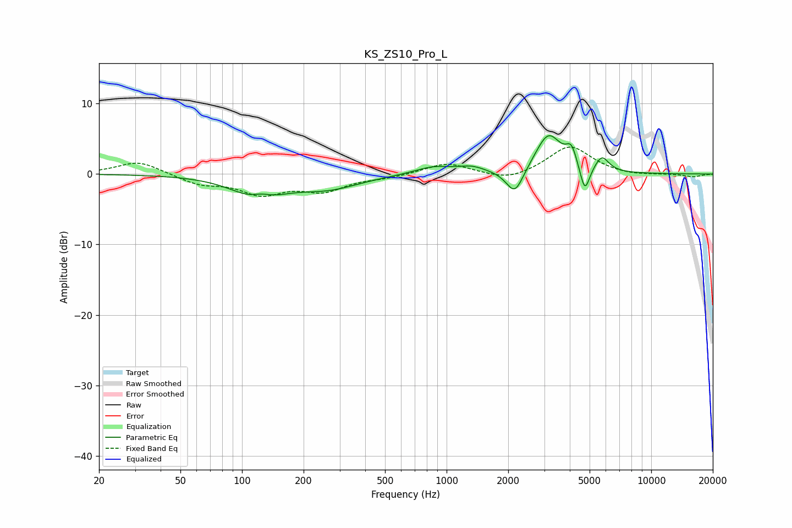

# KS_ZS10_Pro_L
See [usage instructions](https://github.com/jaakkopasanen/AutoEq#usage) for more options and info.

### Parametric EQs
Apply preamp of -5.5 dB when using parametric equalizer.

|   # | Type    |   Fc (Hz) |    Q |   Gain (dB) |
|-----|---------|-----------|------|-------------|
|   1 | Peaking |       120 | 1.16 |        -3.2 |
|   2 | Peaking |       124 | 2.9  |         0.9 |
|   3 | Peaking |       264 | 0.92 |        -1.8 |
|   4 | Peaking |       864 | 1.51 |         1.1 |
|   5 | Peaking |      1326 | 2.19 |         0.8 |
|   6 | Peaking |      2155 | 3.37 |        -3.7 |
|   7 | Peaking |      3145 | 2.22 |         5.6 |
|   8 | Peaking |      4074 | 5.34 |         2.6 |
|   9 | Peaking |      4738 | 6    |        -4   |
|  10 | Peaking |      5744 | 4.16 |         2.1 |

### Fixed Band EQs
When using fixed band (also called graphic) equalizer, apply preamp of **-3.9 dB** (if available) and set gains manually with these parameters.

|   # | Type    |   Fc (Hz) |    Q |   Gain (dB) |
|-----|---------|-----------|------|-------------|
|   1 | Peaking |        31 | 1.41 |         1.9 |
|   2 | Peaking |        62 | 1.41 |        -1.3 |
|   3 | Peaking |       125 | 1.41 |        -2.6 |
|   4 | Peaking |       250 | 1.41 |        -2.2 |
|   5 | Peaking |       500 | 1.41 |        -0.4 |
|   6 | Peaking |      1000 | 1.41 |         1.6 |
|   7 | Peaking |      2000 | 1.41 |        -1.1 |
|   8 | Peaking |      4000 | 1.41 |         4   |
|   9 | Peaking |      8000 | 1.41 |        -0.3 |
|  10 | Peaking |     16000 | 1.41 |        -0.4 |

### Graphs

