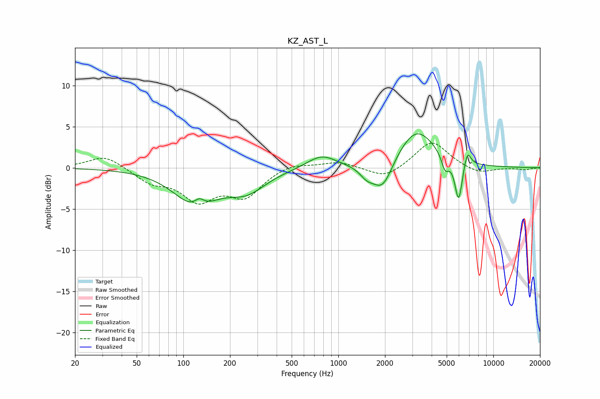

# KZ_AST_L
See [usage instructions](https://github.com/jaakkopasanen/AutoEq#usage) for more options and info.

### Parametric EQs
Apply preamp of -4.2 dB when using parametric equalizer.

|   # | Type    |   Fc (Hz) |    Q |   Gain (dB) |
|-----|---------|-----------|------|-------------|
|   1 | Peaking |       120 | 1.03 |        -4.3 |
|   2 | Peaking |       127 | 4.35 |         1   |
|   3 | Peaking |       257 | 1.14 |        -2.4 |
|   4 | Peaking |       779 | 1.5  |         1.6 |
|   5 | Peaking |      1530 | 3.07 |        -1.2 |
|   6 | Peaking |      1930 | 2.2  |        -3.6 |
|   7 | Peaking |      3192 | 1.15 |         4.8 |
|   8 | Peaking |      4882 | 6    |        -1.8 |
|   9 | Peaking |      5971 | 5.77 |        -5.1 |
|  10 | Peaking |      6801 | 6    |         2   |

### Fixed Band EQs
When using fixed band (also called graphic) equalizer, apply preamp of **-3.1 dB** (if available) and set gains manually with these parameters.

|   # | Type    |   Fc (Hz) |    Q |   Gain (dB) |
|-----|---------|-----------|------|-------------|
|   1 | Peaking |        31 | 1.41 |         1.6 |
|   2 | Peaking |        62 | 1.41 |        -1.6 |
|   3 | Peaking |       125 | 1.41 |        -3.6 |
|   4 | Peaking |       250 | 1.41 |        -3.2 |
|   5 | Peaking |       500 | 1.41 |         0.7 |
|   6 | Peaking |      1000 | 1.41 |         0.8 |
|   7 | Peaking |      2000 | 1.41 |        -1.4 |
|   8 | Peaking |      4000 | 1.41 |         3.3 |
|   9 | Peaking |      8000 | 1.41 |        -0.8 |
|  10 | Peaking |     16000 | 1.41 |        -0.2 |

### Graphs

