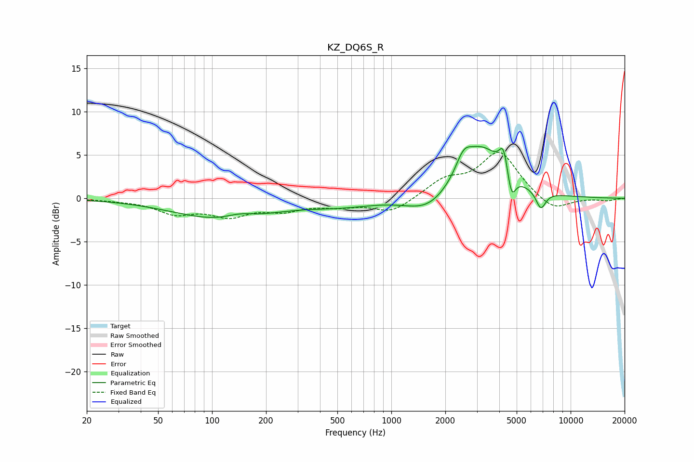

# KZ_DQ6S_R
See [usage instructions](https://github.com/jaakkopasanen/AutoEq#usage) for more options and info.

### Parametric EQs
Apply preamp of -6.1 dB when using parametric equalizer.

|   # | Type    |   Fc (Hz) |    Q |   Gain (dB) |
|-----|---------|-----------|------|-------------|
|   1 | Peaking |       115 | 0.52 |        -2.4 |
|   2 | Peaking |       142 | 1.87 |         0.6 |
|   3 | Peaking |       526 | 0.77 |        -0.7 |
|   4 | Peaking |      1610 | 1.16 |        -2   |
|   5 | Peaking |      2526 | 3.28 |         2.1 |
|   6 | Peaking |      3192 | 1.15 |         5.8 |
|   7 | Peaking |      4204 | 5.99 |         1.8 |
|   8 | Peaking |      4261 | 6    |         1.1 |
|   9 | Peaking |      4676 | 6    |        -3   |
|  10 | Peaking |      6821 | 4.97 |        -2.1 |

### Fixed Band EQs
When using fixed band (also called graphic) equalizer, apply preamp of **-5.4 dB** (if available) and set gains manually with these parameters.

|   # | Type    |   Fc (Hz) |    Q |   Gain (dB) |
|-----|---------|-----------|------|-------------|
|   1 | Peaking |        31 | 1.41 |        -0.1 |
|   2 | Peaking |        62 | 1.41 |        -1.6 |
|   3 | Peaking |       125 | 1.41 |        -1.8 |
|   4 | Peaking |       250 | 1.41 |        -1.2 |
|   5 | Peaking |       500 | 1.41 |        -0.7 |
|   6 | Peaking |      1000 | 1.41 |        -1.6 |
|   7 | Peaking |      2000 | 1.41 |         1.9 |
|   8 | Peaking |      4000 | 1.41 |         5.3 |
|   9 | Peaking |      8000 | 1.41 |        -1.6 |
|  10 | Peaking |     16000 | 1.41 |        -0.3 |

### Graphs

