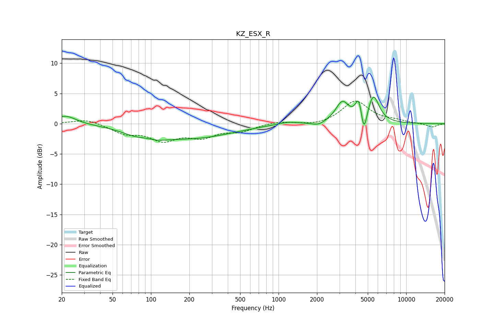

# KZ_ESX_R
See [usage instructions](https://github.com/jaakkopasanen/AutoEq#usage) for more options and info.

### Parametric EQs
Apply preamp of -4.5 dB when using parametric equalizer.

|   # | Type    |   Fc (Hz) |    Q |   Gain (dB) |
|-----|---------|-----------|------|-------------|
|   1 | Peaking |        22 | 1.81 |         1.4 |
|   2 | Peaking |        91 | 2.24 |         0.6 |
|   3 | Peaking |        91 | 1    |        -2.1 |
|   4 | Peaking |       233 | 0.49 |        -2.1 |
|   5 | Peaking |      1166 | 1.61 |         0.5 |
|   6 | Peaking |      2046 | 2.91 |        -0.6 |
|   7 | Peaking |      3159 | 2.7  |         3.4 |
|   8 | Peaking |      4256 | 5.56 |         3.4 |
|   9 | Peaking |      4662 | 6    |        -4.1 |
|  10 | Peaking |      5532 | 3.15 |         4.5 |

### Fixed Band EQs
When using fixed band (also called graphic) equalizer, apply preamp of **-3.8 dB** (if available) and set gains manually with these parameters.

|   # | Type    |   Fc (Hz) |    Q |   Gain (dB) |
|-----|---------|-----------|------|-------------|
|   1 | Peaking |        31 | 1.41 |         0.8 |
|   2 | Peaking |        62 | 1.41 |        -1.5 |
|   3 | Peaking |       125 | 1.41 |        -2.5 |
|   4 | Peaking |       250 | 1.41 |        -1.9 |
|   5 | Peaking |       500 | 1.41 |        -1.1 |
|   6 | Peaking |      1000 | 1.41 |         0.4 |
|   7 | Peaking |      2000 | 1.41 |        -0.4 |
|   8 | Peaking |      4000 | 1.41 |         3.7 |
|   9 | Peaking |      8000 | 1.41 |         0.4 |
|  10 | Peaking |     16000 | 1.41 |        -0.6 |

### Graphs

