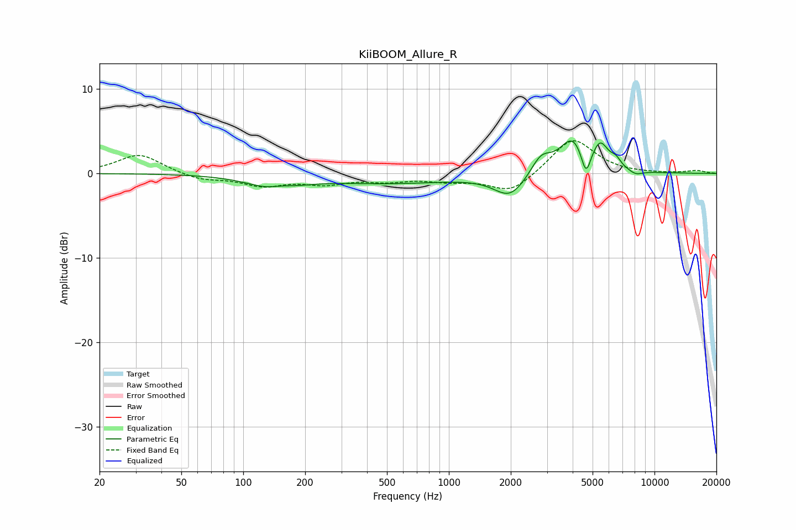

# KiiBOOM_Allure_R
See [usage instructions](https://github.com/jaakkopasanen/AutoEq#usage) for more options and info.

### Parametric EQs
Apply preamp of -3.9 dB when using parametric equalizer.

|   # | Type    |   Fc (Hz) |    Q |   Gain (dB) |
|-----|---------|-----------|------|-------------|
|   1 | Peaking |       142 | 1.19 |        -1.7 |
|   2 | Peaking |       152 | 2.45 |         0.5 |
|   3 | Peaking |       524 | 0.43 |        -1.1 |
|   4 | Peaking |      1985 | 1.83 |        -2.7 |
|   5 | Peaking |      2807 | 2.86 |         2.1 |
|   6 | Peaking |      3994 | 2.2  |         4   |
|   7 | Peaking |      4644 | 6    |        -3.2 |
|   8 | Peaking |      5451 | 3.49 |         2.9 |
|   9 | Peaking |      6485 | 5.52 |         0.9 |
|  10 | Peaking |      8106 | 3.96 |        -0.5 |

### Fixed Band EQs
When using fixed band (also called graphic) equalizer, apply preamp of **-4.0 dB** (if available) and set gains manually with these parameters.

|   # | Type    |   Fc (Hz) |    Q |   Gain (dB) |
|-----|---------|-----------|------|-------------|
|   1 | Peaking |        31 | 1.41 |         2.3 |
|   2 | Peaking |        62 | 1.41 |        -0.8 |
|   3 | Peaking |       125 | 1.41 |        -1.3 |
|   4 | Peaking |       250 | 1.41 |        -1.1 |
|   5 | Peaking |       500 | 1.41 |        -0.7 |
|   6 | Peaking |      1000 | 1.41 |        -0.7 |
|   7 | Peaking |      2000 | 1.41 |        -2.3 |
|   8 | Peaking |      4000 | 1.41 |         4.3 |
|   9 | Peaking |      8000 | 1.41 |        -0   |
|  10 | Peaking |     16000 | 1.41 |         0.3 |

### Graphs

