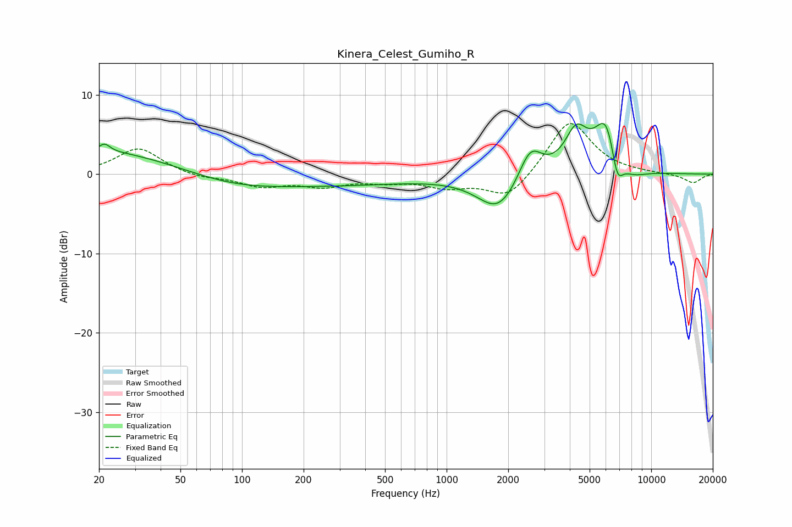

# Kinera_Celest_Gumiho_R
See [usage instructions](https://github.com/jaakkopasanen/AutoEq#usage) for more options and info.

### Parametric EQs
Apply preamp of -6.5 dB when using parametric equalizer.

|   # | Type    |   Fc (Hz) |    Q |   Gain (dB) |
|-----|---------|-----------|------|-------------|
|   1 | Peaking |        20 | 0.4  |         3.1 |
|   2 | Peaking |        21 | 5.49 |         0.9 |
|   3 | Peaking |        87 | 0.63 |        -1   |
|   4 | Peaking |       247 | 0.31 |        -1.3 |
|   5 | Peaking |      1798 | 1.38 |        -4.7 |
|   6 | Peaking |      2563 | 2.42 |         4.3 |
|   7 | Peaking |      4299 | 2.51 |         4.9 |
|   8 | Peaking |      6059 | 2.32 |         7.2 |
|   9 | Peaking |      6806 | 4.51 |        -4.4 |
|  10 | Peaking |      7936 | 1.87 |        -1.4 |

### Fixed Band EQs
When using fixed band (also called graphic) equalizer, apply preamp of **-6.5 dB** (if available) and set gains manually with these parameters.

|   # | Type    |   Fc (Hz) |    Q |   Gain (dB) |
|-----|---------|-----------|------|-------------|
|   1 | Peaking |        31 | 1.41 |         3.3 |
|   2 | Peaking |        62 | 1.41 |        -0.5 |
|   3 | Peaking |       125 | 1.41 |        -1.4 |
|   4 | Peaking |       250 | 1.41 |        -1.3 |
|   5 | Peaking |       500 | 1.41 |        -0.7 |
|   6 | Peaking |      1000 | 1.41 |        -1.4 |
|   7 | Peaking |      2000 | 1.41 |        -3.2 |
|   8 | Peaking |      4000 | 1.41 |         7   |
|   9 | Peaking |      8000 | 1.41 |         0.1 |
|  10 | Peaking |     16000 | 1.41 |        -1.1 |

### Graphs

