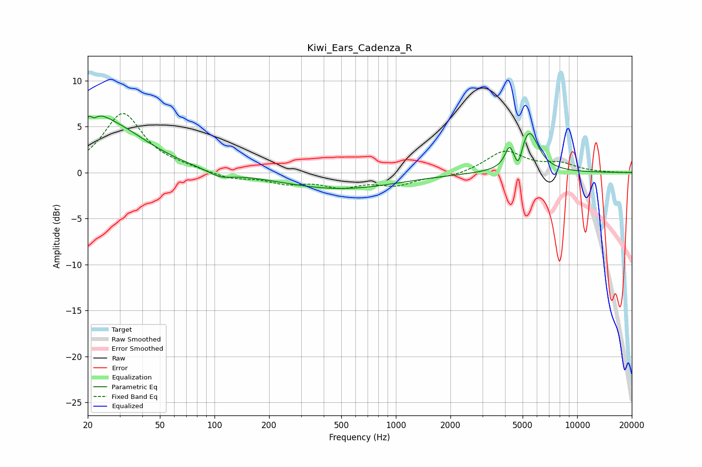

# Kiwi_Ears_Cadenza_R
See [usage instructions](https://github.com/jaakkopasanen/AutoEq#usage) for more options and info.

### Parametric EQs
Apply preamp of -6.2 dB when using parametric equalizer.

|   # | Type    |   Fc (Hz) |    Q |   Gain (dB) |
|-----|---------|-----------|------|-------------|
|   1 | Peaking |        21 | 5.76 |         3.3 |
|   2 | Peaking |        21 | 6    |        -3.1 |
|   3 | Peaking |        22 | 2.1  |         1.7 |
|   4 | Peaking |        27 | 0.7  |         4.7 |
|   5 | Peaking |       107 | 2.09 |        -0.7 |
|   6 | Peaking |       490 | 0.44 |        -1.8 |
|   7 | Peaking |      4234 | 6    |         1.9 |
|   8 | Peaking |      4741 | 6    |        -2.4 |
|   9 | Peaking |      4969 | 2.78 |         0.7 |
|  10 | Peaking |      5435 | 2.73 |         4.1 |

### Fixed Band EQs
When using fixed band (also called graphic) equalizer, apply preamp of **-6.5 dB** (if available) and set gains manually with these parameters.

|   # | Type    |   Fc (Hz) |    Q |   Gain (dB) |
|-----|---------|-----------|------|-------------|
|   1 | Peaking |        31 | 1.41 |         6.4 |
|   2 | Peaking |        62 | 1.41 |         0.4 |
|   3 | Peaking |       125 | 1.41 |        -0.7 |
|   4 | Peaking |       250 | 1.41 |        -1   |
|   5 | Peaking |       500 | 1.41 |        -1.3 |
|   6 | Peaking |      1000 | 1.41 |        -1.2 |
|   7 | Peaking |      2000 | 1.41 |        -0.5 |
|   8 | Peaking |      4000 | 1.41 |         2.3 |
|   9 | Peaking |      8000 | 1.41 |         0.9 |
|  10 | Peaking |     16000 | 1.41 |         0   |

### Graphs

