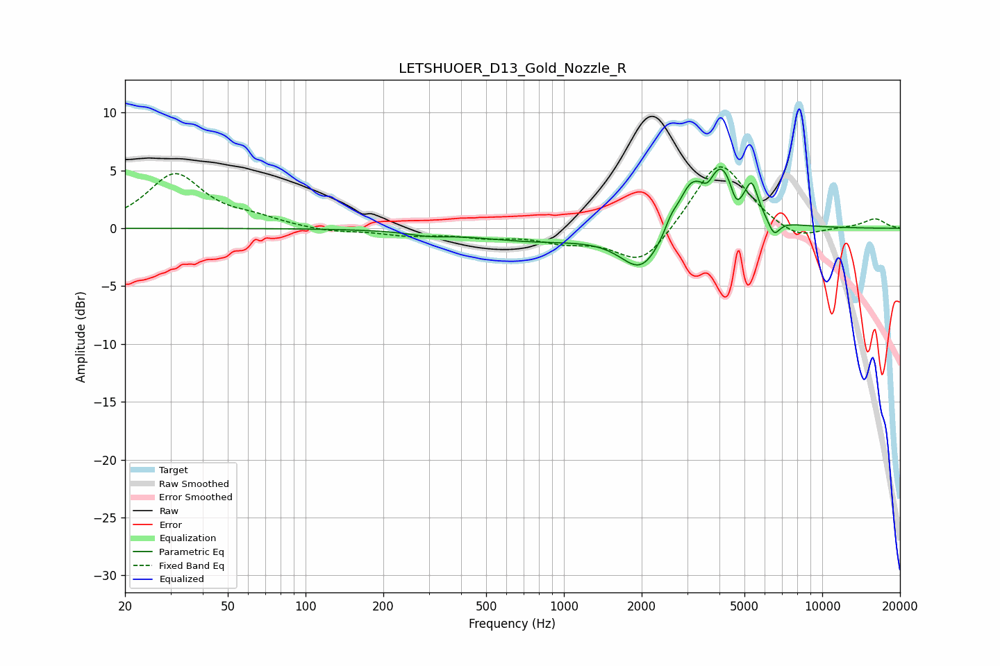

# LETSHUOER_D13_Gold_Nozzle_R
See [usage instructions](https://github.com/jaakkopasanen/AutoEq#usage) for more options and info.

### Parametric EQs
Apply preamp of -5.2 dB when using parametric equalizer.

|   # | Type    |   Fc (Hz) |    Q |   Gain (dB) |
|-----|---------|-----------|------|-------------|
|   1 | Peaking |       298 | 1.99 |        -0.3 |
|   2 | Peaking |       782 | 0.58 |        -1   |
|   3 | Peaking |      1999 | 1.75 |        -3.6 |
|   4 | Peaking |      2597 | 6    |         0.8 |
|   5 | Peaking |      3082 | 2.83 |         3   |
|   6 | Peaking |      3606 | 6    |        -1   |
|   7 | Peaking |      4084 | 2.1  |         5.5 |
|   8 | Peaking |      4645 | 6    |        -2   |
|   9 | Peaking |      5340 | 6    |         2.4 |
|  10 | Peaking |      6504 | 5.99 |        -1.4 |

### Fixed Band EQs
When using fixed band (also called graphic) equalizer, apply preamp of **-5.4 dB** (if available) and set gains manually with these parameters.

|   # | Type    |   Fc (Hz) |    Q |   Gain (dB) |
|-----|---------|-----------|------|-------------|
|   1 | Peaking |        31 | 1.41 |         4.6 |
|   2 | Peaking |        62 | 1.41 |         0.7 |
|   3 | Peaking |       125 | 1.41 |        -0.3 |
|   4 | Peaking |       250 | 1.41 |        -0.5 |
|   5 | Peaking |       500 | 1.41 |        -0.6 |
|   6 | Peaking |      1000 | 1.41 |        -1   |
|   7 | Peaking |      2000 | 1.41 |        -3.3 |
|   8 | Peaking |      4000 | 1.41 |         6.1 |
|   9 | Peaking |      8000 | 1.41 |        -1.2 |
|  10 | Peaking |     16000 | 1.41 |         0.8 |

### Graphs

