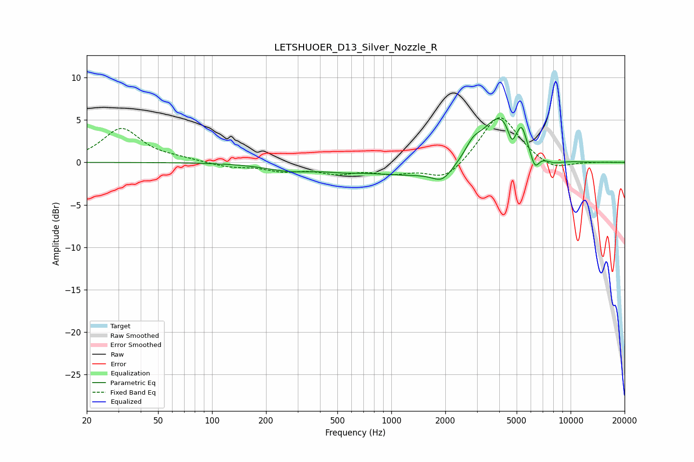

# LETSHUOER_D13_Silver_Nozzle_R
See [usage instructions](https://github.com/jaakkopasanen/AutoEq#usage) for more options and info.

### Parametric EQs
Apply preamp of -5.2 dB when using parametric equalizer.

|   # | Type    |   Fc (Hz) |    Q |   Gain (dB) |
|-----|---------|-----------|------|-------------|
|   1 | Peaking |       271 | 1.05 |        -0.8 |
|   2 | Peaking |       529 | 1.54 |        -0.3 |
|   3 | Peaking |      1926 | 2.66 |        -1.4 |
|   4 | Peaking |      2088 | 0.34 |        -2.1 |
|   5 | Peaking |      2850 | 3.23 |         1.4 |
|   6 | Peaking |      4066 | 1.19 |         7.1 |
|   7 | Peaking |      4699 | 6    |        -2.3 |
|   8 | Peaking |      5345 | 6    |         1.8 |
|   9 | Peaking |      6311 | 5.3  |        -2.1 |
|  10 | Peaking |      7968 | 2.42 |        -0.6 |

### Fixed Band EQs
When using fixed band (also called graphic) equalizer, apply preamp of **-5.4 dB** (if available) and set gains manually with these parameters.

|   # | Type    |   Fc (Hz) |    Q |   Gain (dB) |
|-----|---------|-----------|------|-------------|
|   1 | Peaking |        31 | 1.41 |         4   |
|   2 | Peaking |        62 | 1.41 |         0.3 |
|   3 | Peaking |       125 | 1.41 |        -0.5 |
|   4 | Peaking |       250 | 1.41 |        -0.9 |
|   5 | Peaking |       500 | 1.41 |        -1.1 |
|   6 | Peaking |      1000 | 1.41 |        -1   |
|   7 | Peaking |      2000 | 1.41 |        -2.2 |
|   8 | Peaking |      4000 | 1.41 |         5.8 |
|   9 | Peaking |      8000 | 1.41 |        -1.1 |
|  10 | Peaking |     16000 | 1.41 |         0   |

### Graphs

