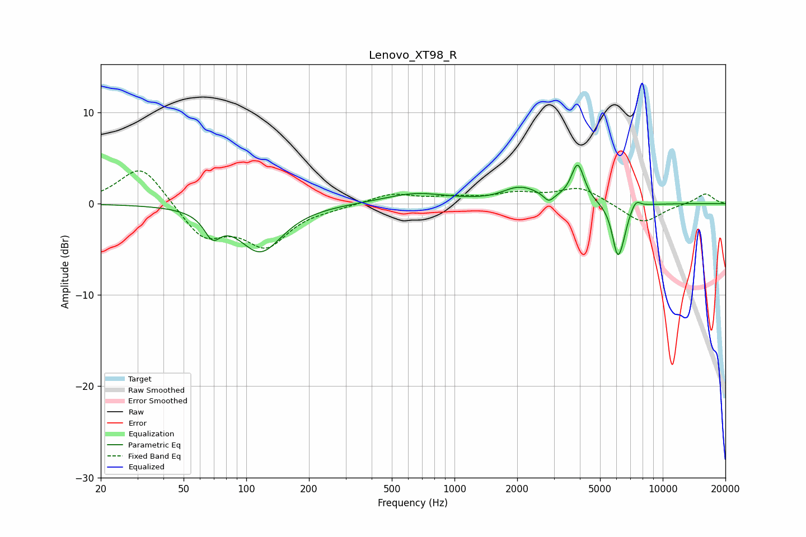

# Lenovo_XT98_R
See [usage instructions](https://github.com/jaakkopasanen/AutoEq#usage) for more options and info.

### Parametric EQs
Apply preamp of -4.3 dB when using parametric equalizer.

|   # | Type    |   Fc (Hz) |    Q |   Gain (dB) |
|-----|---------|-----------|------|-------------|
|   1 | Peaking |        69 | 3.65 |        -2.4 |
|   2 | Peaking |       117 | 1.35 |        -5.2 |
|   3 | Peaking |       649 | 0.93 |         1.1 |
|   4 | Peaking |      1569 | 1.92 |        -0.2 |
|   5 | Peaking |      2058 | 1.49 |         1.7 |
|   6 | Peaking |      2836 | 6    |        -0.9 |
|   7 | Peaking |      3905 | 4.48 |         4.2 |
|   8 | Peaking |      6071 | 5.19 |        -5.3 |
|   9 | Peaking |      6478 | 6    |        -1.2 |
|  10 | Peaking |      7433 | 5.99 |         0.9 |

### Fixed Band EQs
When using fixed band (also called graphic) equalizer, apply preamp of **-3.7 dB** (if available) and set gains manually with these parameters.

|   # | Type    |   Fc (Hz) |    Q |   Gain (dB) |
|-----|---------|-----------|------|-------------|
|   1 | Peaking |        31 | 1.41 |         4.4 |
|   2 | Peaking |        62 | 1.41 |        -3.7 |
|   3 | Peaking |       125 | 1.41 |        -4.3 |
|   4 | Peaking |       250 | 1.41 |        -0.3 |
|   5 | Peaking |       500 | 1.41 |         1.1 |
|   6 | Peaking |      1000 | 1.41 |         0.5 |
|   7 | Peaking |      2000 | 1.41 |         1   |
|   8 | Peaking |      4000 | 1.41 |         1.8 |
|   9 | Peaking |      8000 | 1.41 |        -2.2 |
|  10 | Peaking |     16000 | 1.41 |         1.1 |

### Graphs

