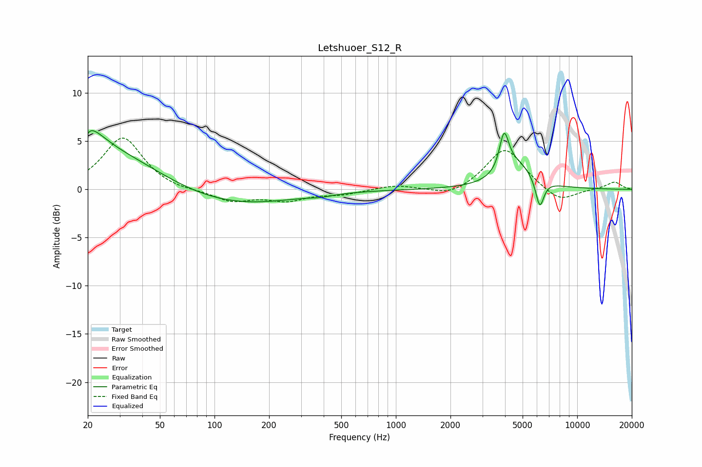

# Letshuoer_S12_R
See [usage instructions](https://github.com/jaakkopasanen/AutoEq#usage) for more options and info.

### Parametric EQs
Apply preamp of -6.2 dB when using parametric equalizer.

|   # | Type    |   Fc (Hz) |    Q |   Gain (dB) |
|-----|---------|-----------|------|-------------|
|   1 | Peaking |        20 | 5.99 |        -3.1 |
|   2 | Peaking |        20 | 5.85 |         3.1 |
|   3 | Peaking |        21 | 1.94 |         1.6 |
|   4 | Peaking |        22 | 0.38 |         4.8 |
|   5 | Peaking |       101 | 0.37 |        -2.1 |
|   6 | Peaking |       386 | 2.73 |        -0.2 |
|   7 | Peaking |      3918 | 6    |         2.3 |
|   8 | Peaking |      4011 | 5.49 |         1.6 |
|   9 | Peaking |      4612 | 1.49 |         2.6 |
|  10 | Peaking |      6216 | 5.94 |        -3   |

### Fixed Band EQs
When using fixed band (also called graphic) equalizer, apply preamp of **-5.4 dB** (if available) and set gains manually with these parameters.

|   # | Type    |   Fc (Hz) |    Q |   Gain (dB) |
|-----|---------|-----------|------|-------------|
|   1 | Peaking |        31 | 1.41 |         5.4 |
|   2 | Peaking |        62 | 1.41 |        -0.2 |
|   3 | Peaking |       125 | 1.41 |        -1.2 |
|   4 | Peaking |       250 | 1.41 |        -1   |
|   5 | Peaking |       500 | 1.41 |        -0.5 |
|   6 | Peaking |      1000 | 1.41 |         0.5 |
|   7 | Peaking |      2000 | 1.41 |        -0.8 |
|   8 | Peaking |      4000 | 1.41 |         4.4 |
|   9 | Peaking |      8000 | 1.41 |        -1.4 |
|  10 | Peaking |     16000 | 1.41 |         0.8 |

### Graphs

