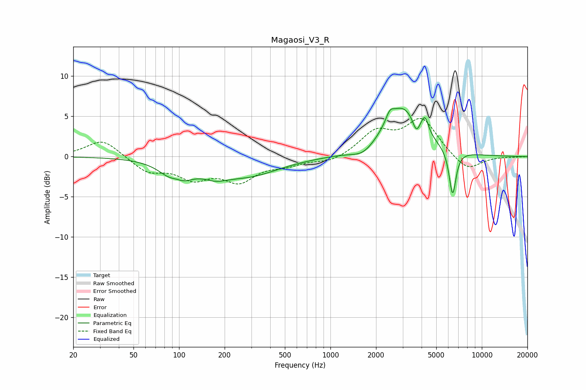

# Magaosi_V3_R
See [usage instructions](https://github.com/jaakkopasanen/AutoEq#usage) for more options and info.

### Parametric EQs
Apply preamp of -6.1 dB when using parametric equalizer.

|   # | Type    |   Fc (Hz) |    Q |   Gain (dB) |
|-----|---------|-----------|------|-------------|
|   1 | Peaking |        96 | 2.99 |         1.4 |
|   2 | Peaking |        96 | 1.76 |        -3.5 |
|   3 | Peaking |       173 | 1.7  |        -1.1 |
|   4 | Peaking |       284 | 0.68 |        -2.2 |
|   5 | Peaking |      1655 | 1.86 |        -1.2 |
|   6 | Peaking |      2466 | 5.43 |         1.2 |
|   7 | Peaking |      2991 | 1.17 |         6.1 |
|   8 | Peaking |      3688 | 5.99 |        -1.7 |
|   9 | Peaking |      4205 | 6    |         2   |
|  10 | Peaking |      6410 | 6    |        -5.7 |

### Fixed Band EQs
When using fixed band (also called graphic) equalizer, apply preamp of **-4.8 dB** (if available) and set gains manually with these parameters.

|   # | Type    |   Fc (Hz) |    Q |   Gain (dB) |
|-----|---------|-----------|------|-------------|
|   1 | Peaking |        31 | 1.41 |         2.2 |
|   2 | Peaking |        62 | 1.41 |        -1.8 |
|   3 | Peaking |       125 | 1.41 |        -2.4 |
|   4 | Peaking |       250 | 1.41 |        -2.8 |
|   5 | Peaking |       500 | 1.41 |        -0.9 |
|   6 | Peaking |      1000 | 1.41 |        -0.8 |
|   7 | Peaking |      2000 | 1.41 |         2.9 |
|   8 | Peaking |      4000 | 1.41 |         4.5 |
|   9 | Peaking |      8000 | 1.41 |        -1.9 |
|  10 | Peaking |     16000 | 1.41 |        -0   |

### Graphs

